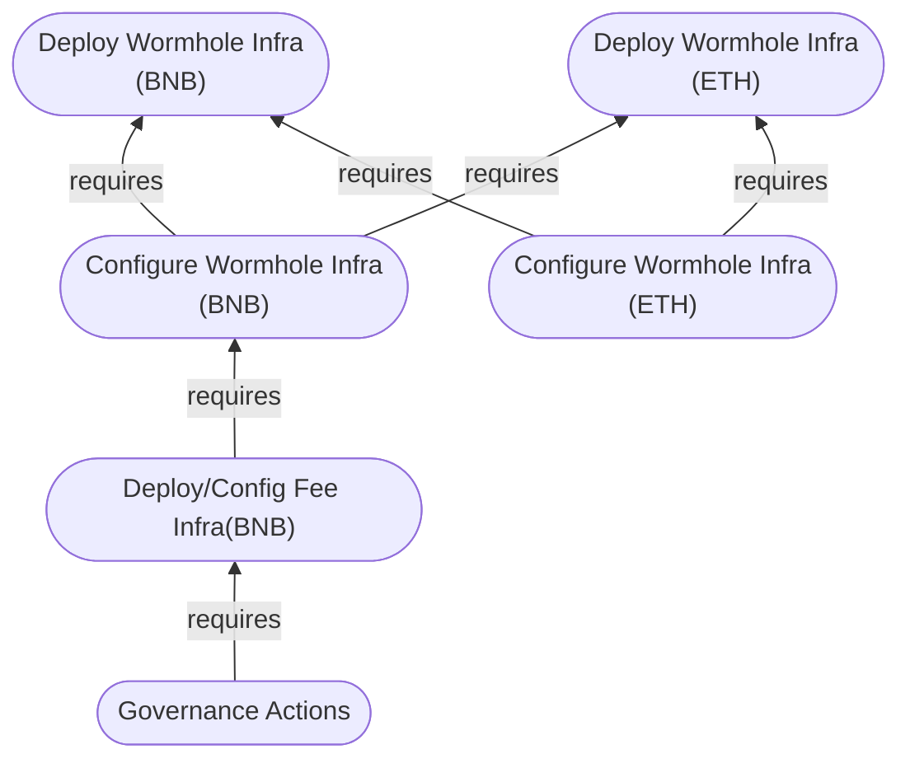
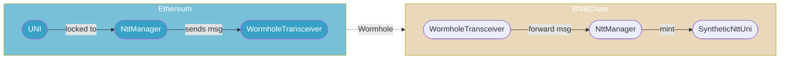
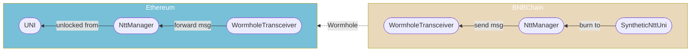
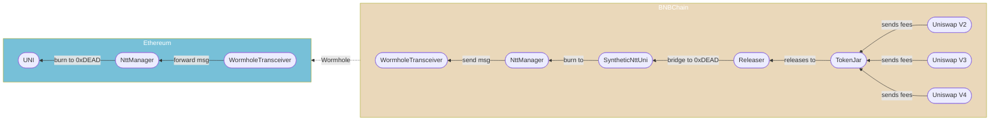

# Proposal-4

## Definitions

- Home chain: Ethereum L1
- Foreign chain: Generic name for non-Ethereum L1 chain.
- Local chain: Refers to the same chain in whatever context in which it's mentioned.
- UNI:
    - For Ethereum, this is the canonical Uniswap token.
    - For foreign chains, this is a synthetic Uniswap token.
- TokenJar: Contract which "owns" the Uniswap V2, V3, and V4 protocols and collects protocol fees.
- Releaser: Contract which releases a basket of tokens from TokenJar in exchange for UNI to burn.
- Fee Collection Infrastructure: UNI, TokenJar, and Releaser.
- Burn:
    - For canonical UNI, this is a `transfer` to `address(0xdead)`.
    - For synthetic UNI, this is a local chain `burn` to enable an unlock on the home chain.

## Abstract

Proposal 4 activates fee switches on Celo, BNB Chain, and Polygon. Celo fee collection
infrastructure has already been deployed and configured for the OP canonical bridge, it needs only
an ownership transition. BNB Chain does not have fee collection infrastructure, there are
prerequisite actions which must be taken before governance can enact the ownership transition.
Polygon also does not have fee collection infrastructure, there are prerequsite actions which must
be taken before governance can enact the ownership transition.

## Action Ordering

Actions must be taken in this order.

For members of governance, the prerequisite action sections are unnecessary, as they can be handled
permissionlessly. See [Governance Actions](#governance-actions).

1. [Deploy Wormhole Infra (BNB)](#deploy-wormhole-infra-bnb-chain)
2. [Deploy Wormhole Infra (ETH)](#deploy-wormhole-infra-ethereum)
3. [Deploy Wormhole Infra (BNB)](#configure-wormhole-infra-bnb-chain)
4. [Configure Wormhole Infra (ETH)](#configure-wormhole-infra-ethereum)
5. [Deploy/Config Fee Infra (BNB)](#deploy-and-configure-fee-infra-bnb-chain)
6. [Governance Actions](#governance-actions)

Dependency graph:



## Wormhole Context

Wormhole team suggests integrators use the new "Native Token Transfer" (Ntt) mechanism for
multichain token management.

We use the "Hub and Spoke" model such that the canonical (Ethereum) UNI represents the "Hub" and the
foreign chain deployments of a synthetic UNI (`SyntheticNttUni`) are the "Spokes".

> In simple terms, this is a "lock, mint, and burn" system where canonical UNI is locked on Ethereum
> so a synthetic UNI can be minted on a foreign chain.

This system requires integrators (us) to deploy on Ethereum and BNB Chain a
`WormholeTransceiver` to process messages and a Wormhole `NttManager` to manage transceivers and
handle other peripheral logic such as message attestation and rate limiting (although we eschew rate
limiting for simplicity of deployment and authority management). The `WormholeTransceiver`
deployments on Ethereum and BNB Chain be mutually aware of one another, as do the `NttManager`
deployments on Etheruem and BNB Chain. Additionally, for each chain, the `NttManager` must store the
local `WormholeTransceiver` deployment in its own registry.

Finally, for BNB Chain, there must be a `SyntheticNttUni` deployment which allows mint and burn
authority to the `NttManager` such that it may process mints and burns as appropriate.

### Transfer UNI to BNBChain Flow



### Transfer SyntheticNttUni to Ethereum Flow



### Burn UNI via Releaser from BNBChain Flow



## Prerequisite Actions

### Deploy Wormhole Infra BNB Chain

Foundry Script:

[`./deploys/DeployWormholeInfraBNBChain.s.sol`](./deploys/DeployWormholeInfraBNBChain.s.sol)

Shell command:

```bash
# from root directory of this repository:
forge script script/proposal-4/deploys/DeployWormholeInfraBNBChain.s.sol:DeployWormholeInfraBNBChainScript
```

Transactions:

| Index | Action                                                               |
| ----- | -------------------------------------------------------------------- |
| 00    | Deploy SyntheticNttUni.                                              |
| 01    | Deploy NttManager implementation.                                    |
| 02    | Deploy NttManager proxy.                                             |
| 03    | Initialize NttManager proxy.                                         |
| 04    | Deploy WormholeTransceiver implementation.                           |
| 05    | Deploy WormholeTransceiver proxy.                                    |
| 06    | Initialize WormholeTransceiver proxy.                                |
| 07    | Set NttManager proxy's transceiver to the WormholeTransceiver proxy. |
| 08    | Set the threshold of transceiver attestation redundancy.             |
| 09    | Set SyntheticNttUniNtt mint authority to NttManager proxy.           |
| 10    | Transfer ownership of SyntheticNttUni to governance.                 |

#### Deploy SyntheticNttUni

Deploys [`src/wormhole/SyntheticNttUni.sol`](../../src/wormhole/SyntheticNttUni.sol).

Initial ownership is granted to the deployer for ease of configuration, this will be transferred to
governance later in the script.

#### Deploy NttManager implementation

TODO: from here.

#### Deploy NttManager proxy

#### Initialize NttManager proxy

#### Deploy WormholeTransceiver implementation

#### Deploy WormholeTransceiver proxy

#### Initialize WormholeTransceiver proxy

#### Set NttManager proxy's transceiver to the WormholeTransceiver proxy

#### Set the threshold of transceiver attestation redundancy

#### Set SyntheticNttUniNtt mint authority to NttManager proxy

#### Transfer ownership of SyntheticNttUni to governance

### Deploy Wormhole Infra Ethereum

### Configure Wormhole Infra Ethereum

### Deploy Wormhole Infra Ethereum

### Deploy and Configure Fee Infra BNB Chain

### Governance Actions


