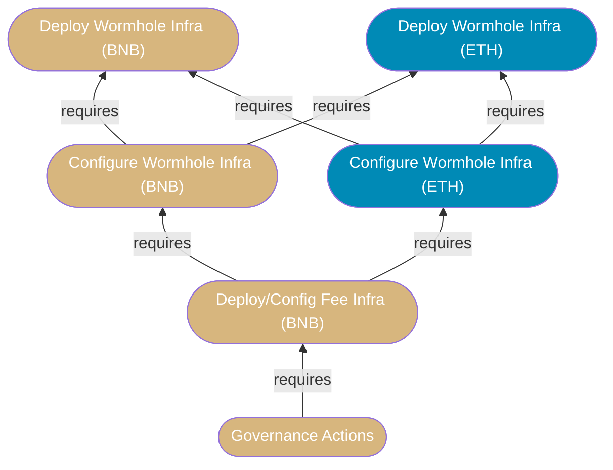
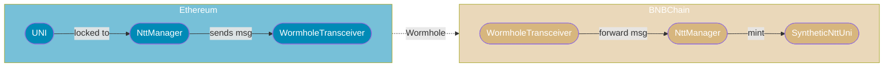
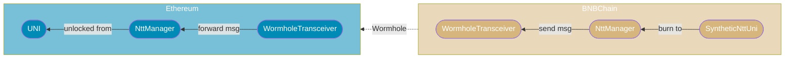
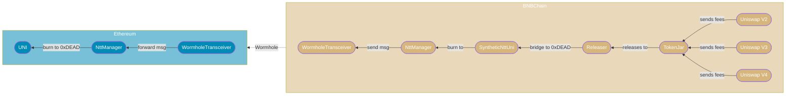

# Proposal-4

- [Proposal-4](#proposal-4)
  - [Definitions](#definitions)
  - [Abstract](#abstract)
  - [Action Ordering](#action-ordering)
  - [Wormhole Context](#wormhole-context)
    - [Transfer UNI to BNBChain Flow](#transfer-uni-to-bnbchain-flow)
    - [Transfer SyntheticNttUni to Ethereum Flow](#transfer-syntheticnttuni-to-ethereum-flow)
    - [Burn UNI via Releaser from BNBChain Flow](#burn-uni-via-releaser-from-bnbchain-flow)
    - [On Wormhole ERC1967 Proxies](#on-wormhole-erc1967-proxies)
  - [Prerequisite Actions](#prerequisite-actions)
    - [1. Deploy Wormhole Infra BNB Chain](#1-deploy-wormhole-infra-bnb-chain)
    - [2. Deploy Wormhole Infra Ethereum](#2-deploy-wormhole-infra-ethereum)
    - [3. Configure Wormhole Infra BNB Chain](#3-configure-wormhole-infra-bnb-chain)
    - [4. Configure Wormhole Infra Ethereum](#4-configure-wormhole-infra-ethereum)
    - [5. Deploy and Configure Fee Infra BNB Chain](#5-deploy-and-configure-fee-infra-bnb-chain)
    - [TODO: Polygon](#todo-polygon)
  - [Governance Actions](#governance-actions)
    - [Celo Actions](#celo-actions)
    - [BNB Chain Actions](#bnb-chain-actions)
    - [Polygon Actions](#polygon-actions)

## Definitions

- Home chain: Ethereum L1
- Foreign chain: Generic name for non-Ethereum L1 chain.
- Local chain: Refers to the same chain in whatever context in which it's mentioned.
- UNI:
    - For Ethereum, this is the canonical Uniswap token.
    - For foreign chains, this is a synthetic Uniswap token.
- TokenJar: Contract which "owns" the Uniswap V2, V3, and V4 protocols and collects protocol fees.
- Releaser: Contract which releases a basket of tokens from TokenJar in exchange for UNI to burn.
- Fee Collection Infrastructure: UNI, TokenJar, and Releaser.
- Burn:
    - For canonical UNI, this is a `transfer` to `address(0xdead)`.
    - For synthetic UNI, this is a local chain `burn` to enable an unlock on the home chain.

## Abstract

Proposal 4 activates fee switches on Celo, BNB Chain, and Polygon. Celo fee collection
infrastructure has already been deployed and configured for the OP canonical bridge, it needs only
an ownership transition. BNB Chain does not have fee collection infrastructure, there are
prerequisite actions which must be taken before governance can enact the ownership transition.
Polygon also does not have fee collection infrastructure, there are prerequsite actions which must
be taken before governance can enact the ownership transition.

## Action Ordering

Actions must be taken in this order.

1. Deploy Wormhole Infra BNB Chain
2. Deploy Wormhole Infra Ethereum
3. Configure Wormhole Infra BNB Chain
4. Configure Wormhole Infra Ethereum
5. Deploy and Configure Fee Infra BNB Chain
6. Governance Proposal

For members of governance, the prerequisite action sections are unnecessary, as they can be handled
permissionlessly. See [Governance Actions](#governance-actions).

Dependency graph:



## Wormhole Context

Wormhole team suggests integrators use the new "Native Token Transfer" (Ntt) mechanism for
multichain token management.

We use the "Hub and Spoke" model such that the canonical (Ethereum) UNI represents the "Hub" and the
foreign chain deployments of a synthetic UNI (`SyntheticNttUni`) are the "Spokes".

> In simple terms, this is a "lock, mint, and burn" system where canonical UNI is locked on Ethereum
> so a synthetic UNI can be minted on a foreign chain.

This system requires integrators (us) to deploy on Ethereum and BNB Chain a
`WormholeTransceiver` to process messages and a Wormhole `NttManager` to manage transceivers and
handle other peripheral logic such as message attestation and rate limiting (although we eschew rate
limiting for simplicity of deployment and authority management). The `WormholeTransceiver`
deployments on Ethereum and BNB Chain be mutually aware of one another, as do the `NttManager`
deployments on Etheruem and BNB Chain. Additionally, for each chain, the `NttManager` must store the
local `WormholeTransceiver` deployment in its own registry.

Finally, for BNB Chain, there must be a `SyntheticNttUni` deployment which allows mint and burn
authority to the `NttManager` such that it may process mints and burns as appropriate.

### Transfer UNI to BNBChain Flow



### Transfer SyntheticNttUni to Ethereum Flow



### Burn UNI via Releaser from BNBChain Flow



### On Wormhole ERC1967 Proxies

We generally avoid upgradeable proxies as they pose a substantial risk to both the users and to the
upgrade authorities to these contracts.

Unfortunately, Wormhole only provides `NttManagerNoRateLimiting` and `WormholeTransceiver` instances
which are programmed to be used as implementations for a proxy. Additionally, Wormhole has
intertwined the authority to upgrade the proxy with the authority to perform maintenance, migration,
and registry updates which may be necessary in time.

**To avoid a substantial refactoring of the wormhole logic and opening new security risks, we use**
**their implementations for now.**

To mitigate the risks of this, however, the proxy ownership is granted to the deployer account
during the prerequisite transactions and then transferred to governance BEFORE the governance
proposal. On Ethereum, the proxy ownership is transferred to `Timelock`, which is owned by
governance. On BNB Chain the proxy ownership is transferred to `UniswapWormholeMessageReceiver`,
which is guarded such that only governance can send it messages through wormhole.

## Prerequisite Actions

### 1. Deploy Wormhole Infra BNB Chain

**Overview**:

On BNB Chain we deploy `SyntheticNttUni`, `NttManagerNoRateLimiting`, `WormholeTransceiver`, and two
`ERC1967Proxy` contracts. We set the implementations of the proxies to be `NttManagerNoRateLimiting`
and `WormholeTransceiver`, but we do not use a proxy for `SyntheticNttUni`. From here we initialize
the proxies, register the `WormholeTransceiver` proxy to the `NttManagerNoRateLimiting` proxy's
transceiver registry, set the `SyntheticNttUni`'s minting authority to `NttManagerNoRateLimiting`,
and transfer ownership of `SyntheticNttUni` to `UniswapWormholeMessageReceiver`.

> Note: The addresses deployed are needed in subsequent prerequisite scripts, so ownership of the
> proxy is transferred in the [`ConfigWormholeInfraBNBChain`](#3-configure-wormhole-infra-bnb-chain)

**Foundry Script**:

[`./deploys/DeployWormholeInfraBNBChain.s.sol`](./deploys/DeployWormholeInfraBNBChain.s.sol)

**Shell Command**:

```bash
# from root directory of this repository:
forge script script/proposal-4/deploys/DeployWormholeInfraBNBChain.s.sol:DeployWormholeInfraBNBChainScript
```

**Transactions**:

| Index | Action                                                               |
| ----- | -------------------------------------------------------------------- |
| 00    | Deploy SyntheticNttUni.                                              |
| 01    | Deploy NttManager implementation.                                    |
| 02    | Deploy NttManager proxy.                                             |
| 03    | Initialize NttManager proxy.                                         |
| 04    | Deploy WormholeTransceiver implementation.                           |
| 05    | Deploy WormholeTransceiver proxy.                                    |
| 06    | Initialize WormholeTransceiver proxy.                                |
| 07    | Set NttManager proxy's transceiver to the WormholeTransceiver proxy. |
| 08    | Set the threshold of transceiver attestation redundancy.             |
| 09    | Set SyntheticNttUniNtt mint authority to NttManager proxy.           |
| 10    | Transfer ownership of SyntheticNttUni to governance.                 |

### 2. Deploy Wormhole Infra Ethereum

**Overview**:

On Etheruem, we deloy `NttManagerNoRateLimiting`, `WormholeTransceiver` and two `ERC1967Proxy`
contracts. We set the implementations of the proxies to be `NttManagerNoRateLimiting` and
`WormholeTransceiver`. From here we initialize the proxies, register the `WormholeTransceiver` proxy
to the `NttManagerNoRateLimiting` transceiver registry, then point the `NttManagerNoRateLimiting` at
the canonical UNI. 

> Note: The addresses deployed are needed in subsequent prerequisite scripts, so ownership of the
> proxy is transferred in the [`ConfigWormholeInfraEthereum`](#4-configure-wormhole-infra-ethereum)

**Foundry Script**:

[`./deploys/DeployWormholeInfraEthereum.s.sol`](./deploys/DeployWormholeInfraEthereum.s.sol)

**Shell Command**:

```bash
# from root directory of this repository:
forge script script/proposal-4/deploys/DeployWormholeInfraEthereum.s.sol:DeployWormholeInfraEthereumScript
```

**Transactions**:

| Index | Action                                                               |
| ----- | -------------------------------------------------------------------- |
| 00    | Deploy NttManager implementation.                                    |
| 01    | Deploy NttManager proxy.                                             |
| 02    | Initialize NttManager proxy.                                         |
| 03    | Deploy WormholeTransceiver implementation.                           |
| 04    | Deploy WormholeTransceiver proxy.                                    |
| 05    | Initialize WormholeTransceiver proxy.                                |
| 06    | Set NttManager proxy's transceiver to the WormholeTransceiver proxy. |
| 07    | Set the threshold of transceiver attestation redundancy.             |

### 3. Configure Wormhole Infra BNB Chain

**Overview**:

We load the addresses from the `broadcast/` directory, which is where the prerequisite deployment
script outputs should be writen. Default files are as follows:

```solidity
string constant BNB_DEPLOY_PATH = "broadcast/DepoyWormholeInfraBNBChain.s.sol/56/run-latest.json";
string constant ETH_DEPLOY_PATH = "broadcast/DeployWormholeInfraEthereum.s.sol/1/run-latest.json";
```

We perform a myriad of contract and state checks before proceeding to minimize risks of malformed or
incorrect data.

From here, we set the `WormholeTransceiver` proxy deployed on Ethereum as a "Wormhole peer" on the
`WormholeTransceiver` proxy deployed on BNB Chain, then we set the `NttManagerNoRateLimiting` proxy
deployed on Ethereum as a "peer" on the `NttManagerNoRateLimiting` proxy deployed on BNB Chain.
Finally we transfer proxy ownership to `Timelock`.

**Foundry Script**:

[`./deploys/ConfigWormholeInfraBNBChain.s.sol`](./deploys/ConfigWormholeInfraBNBChain.s.sol)

**Shell Command**:

```bash
# from root directory of this repository:
forge script script/proposal-4/deploys/ConfigWormholeInfraBNBChain.s.sol:ConfigWormholeInfraBNBChainScript
```

**Transactions**:

| Index | Action                                                                     |
| ----- | -------------------------------------------------------------------------- |
| 00    | Set BNBChain WormholeTransceiver proxy as a peer on the BNBChain Chain Id. |
| 01    | Set the NttManager Proxy on Ethereum as a peer.                            |
| 02    | Transfer proxy ownership to Timelock.                                      |


### 4. Configure Wormhole Infra Ethereum

**Overview**:

We load the addresses from the `broadcast/` directory, which is where the prerequisite deployment
script outputs should be writen. Default files are as follows:

```solidity
string constant BNB_DEPLOY_PATH = "broadcast/DepoyWormholeInfraBNBChain.s.sol/56/run-latest.json";
string constant ETH_DEPLOY_PATH = "broadcast/DeployWormholeInfraEthereum.s.sol/1/run-latest.json";
```

We perform a myriad of contract and state checks before proceeding to minimize risks of malformed or
incorrect data.

From here, we set the `WormholeTransceiver` proxy deployed on BNB Chain as a "Wormhole peer" on the
`WormholeTransceiver` proxy deployed on Ethereum, then we set the `NttManagerNoRateLimiting` proxy
deployed on BNB Chain as a "peer" on the `NttManagerNoRateLimiting` proxy deployed on Ethereum.
Finally we transfer proxy ownership to `UniswapWormholeMessageReceiver`.

**Foundry Script**:

[`./deploys/ConfigWormholeInfraEthereum.s.sol`](./deploys/ConfigWormholeInfraEthereum.s.sol)

**Shell Command**:

```bash
# from root directory of this repository:
forge script script/proposal-4/deploys/ConfigWormholeInfraEthereum.s.sol:ConfigWormholeInfraEthereumScript
```

**Transactions**:

| Index | Action                                                                     |
| ----- | -------------------------------------------------------------------------- |
| 00    | Set BNBChain WormholeTransceiver proxy as a peer on the BNBChain Chain Id. |
| 01    | Set the NttManager Proxy on Ethereum as a peer.                            |
| 02    | Transfer proxy ownership to UniswapWormholeMessageReceiver.                |

### 5. Deploy and Configure Fee Infra BNB Chain

**Overview**:

We load the addresses from the `broadcast/` directory, which is where the prerequisite deployment
script outputs should be writen. Default files are as follows:

```solidity
string constant BNB_DEPLOY_PATH = "broadcast/DepoyWormholeInfraBNBChain.s.sol/56/run-latest.json";
```

We perform a myriad of contract and state checks before proceeding to minimize risks of malformed or
incorrect data.

From here, we deploy the `TokenJar` and `WormholeReleaser`, set the `WormholeReleaser` to be the
releaser for `TokenJar`, transfer ownership of each to governance, threshold setting permission to
governance, delpoy the `V3OpenFeeAdapter` and set default fee tiers, then transfer the fee setting
permission and ownership to governance.

**Foundry Script**:

[`./deploys/DeployAndConfigureFeeInfraBNBChain.s.sol`](./deploys/DeployAndConfigureFeeInfraBNBChain.s.sol)

**Shell Command**:

```bash
# from root directory of this repository:
forge script script/proposal-4/deploys/DeployAndConfigureFeeInfraBNBChain.s.sol:DeployAndConfigureFeeInfraBNBChainScript
```

**Transactions**:

| Index | Action                                                                                 |
| ----- | -------------------------------------------------------------------------------------- |
| 00    | Deploy `TokenJar`.                                                                     |
| 01    | Deploy `WormholeReleaser`.                                                             |
| 02    | Set `WormholeReleaser` as the releaser on `TokenJar`.                                  |
| 03    | Transfer `TokenJar` ownership to `UniswapWormholeMessageReceiver`.                     |
| 04    | Set `WormholeReleaser` threshold setter to `UniswapWormholeMessageReceiver`.           |
| 05    | Transfer ownership of `WormholeReleaser` to `UniswapWormholeMessageReceiver`.          |
| 06    | Deploy `V3OpenFeeAdapter`.                                                             |
| 07    | Set `V3OpenFeeAdapter` fee setter to the deployer for configuration.                   |
| 08    | Set `V3OpenFeeAdapter` default fee.                                                    |
| 09    | Set `V3OpenFeeAdapter` fee tier defaults.                                              |
| 10    | Set `V3OpenFeeAdapter` fee tier defaults.                                              |
| 11    | Set `V3OpenFeeAdapter` fee tier defaults.                                              |
| 12    | Set `V3OpenFeeAdapter` fee tier defaults.                                              |
| 13    | Store `V3OpenFeeAdapter` fee tiers.                                                    |
| 14    | Store `V3OpenFeeAdapter` fee tiers.                                                    |
| 15    | Store `V3OpenFeeAdapter` fee tiers.                                                    |
| 16    | Store `V3OpenFeeAdapter` fee tiers.                                                    |
| 17    | Transfer `V3OpenFeeAdapter` fee setter permission to `UniswapWormholeMessageReceiver`. |
| 18    | Transfer `V3OpenFeeAdapter` ownership to `UniswapWormholeMessageReceiver`.             |


### TODO: Polygon

## Governance Actions

Governance takes five actions; one for Celo, one for BNB Chain, and three for Polygon. The actions
on Celo and BNB Chain contain multiple batched operations but Polygon cannot handled batched
operations.

### Celo Actions

**OVERVIEW**:

This action transfers ownership of the protocol to `TokenJar`, which is then owned by a
`CrossChainAccount`. The `CrossChainAccount` is owned on the home chain by the governance-owned
`Timelock`. This means we are migrating off of Wormhole for Celo and onto the Optimism Canonical
bridge.

- `TokenJar` (Celo): https://celoscan.io/address/0x190c22c5085640D1cB60CeC88a4F736Acb59bb6B
- `CrossChainAccount` (Celo): https://celoscan.io/address/0x044aAF330d7fD6AE683EEc5c1C1d1fFf5196B6b7
- `Timelock` (Ethereum): https://etherscan.io/address/0x1a9C8182C09F50C8318d769245beA52c32BE35BC

**ACTIONS**:

- call `UniswapV2Factory.setFeeToSetter` through `UniswapWormholeMessageReceiver`; new `feeToSetter` is `TokenJar`
- call `UniswapV3Factory.setOwner` through `UniswapWormholeMessageReceiver`; new owner is `TokenJar`
- call `PoolManager.transferOwnership` through `UniswapWormholeMessageReceiver`; new owner is `TokenJar`

### BNB Chain Actions

**OVERVIEW**:

This action transfers ownership of the protocol to `TokenJar`, which is then owned by
`UniswapWormholeMessageReceiver`. The `UniswapWormholeMessageReceiver` is owned on the home chain by
the governance-owned `Timelock`. This means we are continuing to use Wormhole for the time-being on
BNB Chain.

- call `UniswapV2Factory.setFeeToSetter` through `UniswapWormholeMessageReceiver`; new `feeToSetter` is `TokenJar`
- call `UniswapV3Factory.setOwner` through `UniswapWormholeMessageReceiver`; new `owner` is `TokenJar`
- call `PoolManager.transferOwnership` through `UniswapWormholeMessageReceiver`; new `owner` is `TokenJar`

### Polygon Actions

**OVERVIEW**:

TODO

**ACTIONS**:

- call `UniswapV2Factory.setFeeToSetter` through `UniswapWormholeMessageReceiver`; new `feeToSetter` is `TokenJar`
- call `UniswapV3Factory.setOwner` through `UniswapWormholeMessageReceiver`; new `owner` is `TokenJar`
- call `PoolManager.transferOwnership` through `UniswapWormholeMessageReceiver`; new `owner` is `TokenJar`
