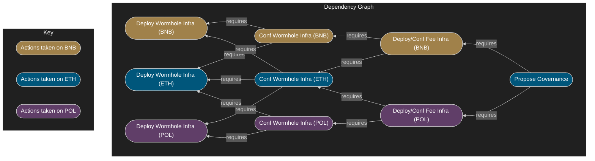
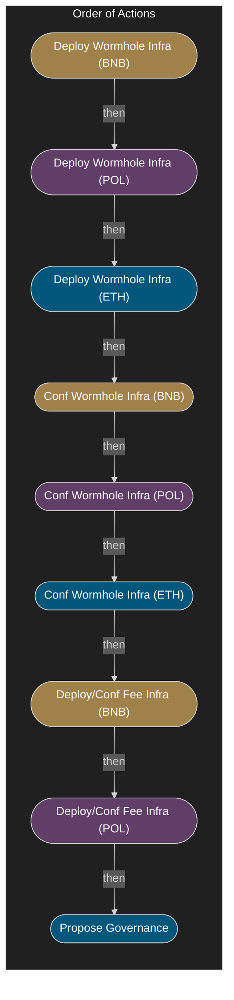
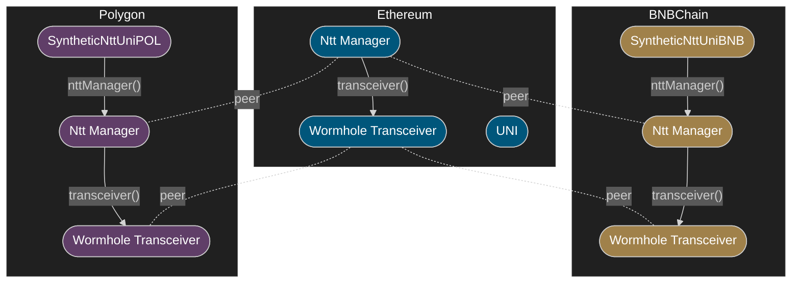
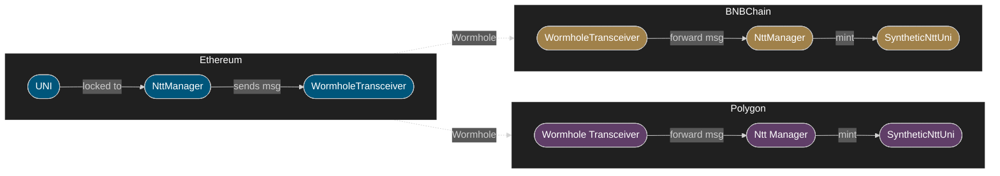
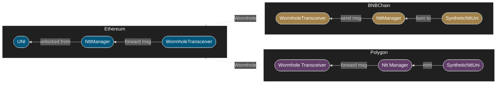
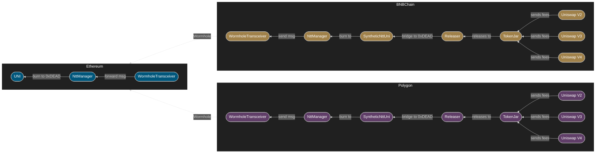
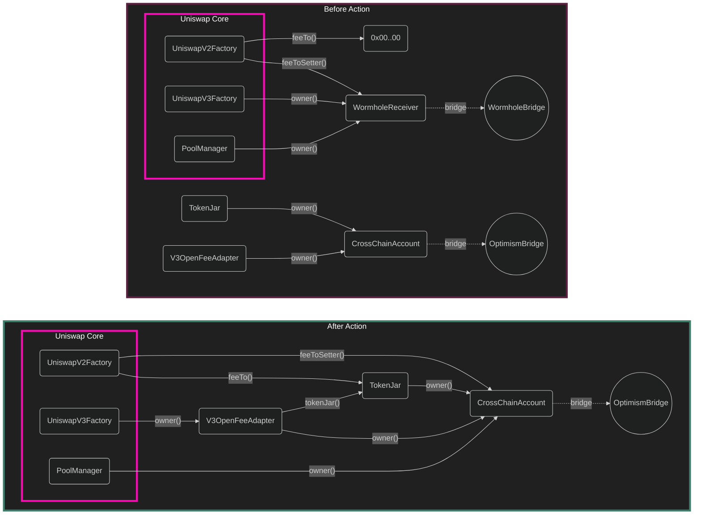
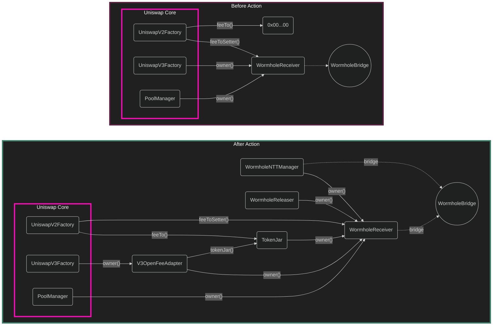
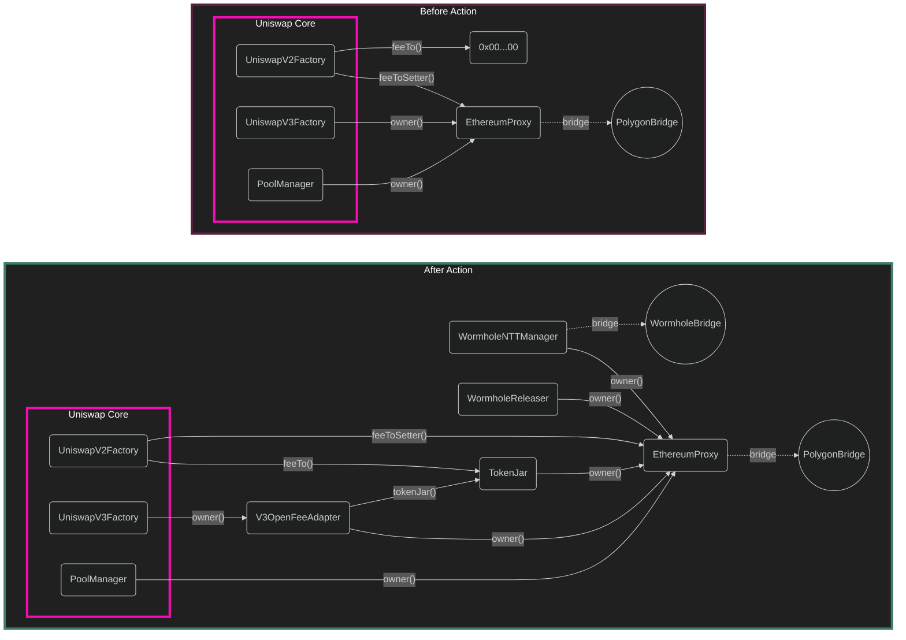

# Proposal-4

- [Proposal-4](#proposal-4)
  - [Definitions](#definitions)
  - [Abstract](#abstract)
  - [Prerequsite Action Ordering](#prerequsite-action-ordering)
  - [Wormhole Context](#wormhole-context)
    - [Send UNI from Etherum to Foreign Chain](#send-uni-from-etherum-to-foreign-chain)
    - [Receive UNI to Ethereum from Foreign Chain](#receive-uni-to-ethereum-from-foreign-chain)
    - [Burn UNI via Releaser over Wormhole](#burn-uni-via-releaser-over-wormhole)
    - [On Wormhole ERC1967 Proxies](#on-wormhole-erc1967-proxies)
  - [Polygon Context](#polygon-context)
  - [Prerequisite Actions](#prerequisite-actions)
    - [1. Deploy Wormhole Infra BNB Chain](#1-deploy-wormhole-infra-bnb-chain)
    - [2. Deploy Wormhole Infra Polygon](#2-deploy-wormhole-infra-polygon)
    - [3. Deploy Wormhole Infra Ethereum](#3-deploy-wormhole-infra-ethereum)
    - [4. Configure Wormhole Infra BNB Chain](#4-configure-wormhole-infra-bnb-chain)
    - [5. Configure Wormhole Infra Polygon](#5-configure-wormhole-infra-polygon)
    - [6. Configure Wormhole Infra Ethereum](#6-configure-wormhole-infra-ethereum)
    - [7. Deploy and Configure Fee Infra BNB Chain](#7-deploy-and-configure-fee-infra-bnb-chain)
    - [8. Deploy and Configure Fee Infra Polygon](#8-deploy-and-configure-fee-infra-polygon)
    - [9. Propose Governance Actions](#9-propose-governance-actions)
  - [Governance Actions](#governance-actions)
    - [Celo](#celo)
    - [BNB Chain Actions](#bnb-chain-actions)
    - [Polygon Actions](#polygon-actions)

TODO:

- add pause-renounce transaction to:
  - bnb
  - ethereum
- update transaction counts in docs for:
  - bnb
  - ethereum
  - polygon

## Definitions

- Home chain: Ethereum L1
- Foreign chain: Generic name for non-Ethereum L1 chain.
- Local chain: Refers to the same chain in whatever context in which it's mentioned.
- UNI:
    - For Ethereum, this is the canonical Uniswap token.
    - For foreign chains, this is a synthetic Uniswap token.
- TokenJar: Contract which "owns" the Uniswap V2, V3, and V4 protocols and collects protocol fees.
- Releaser: Contract which releases a basket of tokens from TokenJar in exchange for UNI to burn.
- Fee Collection Infrastructure: UNI, TokenJar, and Releaser.
- Burn:
    - For canonical UNI, this is a `transfer` to `address(0xdead)`.
    - For synthetic UNI, this is a local chain `burn` to enable an unlock on the home chain.

## Abstract

Proposal 4 activates fee switches on Celo, BNB Chain, and Polygon. Celo fee collection
infrastructure has already been deployed and configured for the OP canonical bridge, it needs only
an ownership transition. BNB Chain does not have fee collection infrastructure, there are
prerequisite actions which must be taken before governance can enact the ownership transition.
Polygon also does not have fee collection infrastructure, there are prerequsite actions which must
be taken before governance can enact the ownership transition.

## Prerequsite Action Ordering

**For members of governance**, the prerequisite action sections are not necessary to read about in
depth, as they can be handled permissionlessly. See [Governance Actions](#governance-actions) for
governance-specific information.

These prerequisite actions must be taken before governance can act. The final action here is to
propose governance-required actions.

<!--
the next comment is required to keep the markdown extensions for vs code from treating this like a
table of contents and auto-forcing the rest of the sections to live here.
-->
<!-- no toc -->
- [1. Deploy Wormhole Infra BNB Chain](#1-deploy-wormhole-infra-bnb-chain)
- [2. Deploy Wormhole Infra Polygon](#2-deploy-wormhole-infra-polygon)
- [3. Deploy Wormhole Infra Ethereum](#3-deploy-wormhole-infra-ethereum)
- [4. Configure Wormhole Infra BNB Chain](#4-configure-wormhole-infra-bnb-chain)
- [5. Configure Wormhole Infra Polygon](#5-configure-wormhole-infra-polygon)
- [6. Configure Wormhole Infra Ethereum](#6-configure-wormhole-infra-ethereum)
- [7. Deploy and Configure Fee Infra BNB Chain](#7-deploy-and-configure-fee-infra-bnb-chain)
- [8. Deploy and Configure Fee Infra Polygon](#8-deploy-and-configure-fee-infra-polygon)
- [9. Propose Governance Actions](#9-propose-governance-actions)

Dependency graph:



Order of Prerequisite Actions:



## Wormhole Context

Wormhole team suggests integrators use the new "Native Token Transfer" (Ntt) mechanism for
multichain token management.

We use the "Hub and Spoke" model such that the canonical (Ethereum) UNI represents the "Hub" and the
foreign chain deployments of a synthetic UNI (`SyntheticNttUni`) are the "Spokes".

> In simple terms, this is a "lock, mint, and burn" system where canonical UNI is locked on Ethereum
> so a synthetic UNI can be minted on a foreign chain.

This system requires integrators (us) to deploy on Ethereum, BNB Chain, and Polygon a
`WormholeTransceiver` to process messages and a Wormhole `NttManager` to manage transceivers and
handle other peripheral logic such as message attestation and rate limiting (although we eschew rate
limiting for simplicity of deployment and authority management). The `WormholeTransceiver` on
Ethereum must be made aware of the `WormholeTransceiver` on BNB Chain and Polygon, also the
`WormholeTransceiver` on BNB Chain and Polygon must be made aware of the one on Ethereum. The
same applies to `NttManager`. Additionally, for each chain, the `NttManager` must be made aware of
its local `WormholeTransceiver` deployment in its own registry.

Finally, for BNB Chain and Polygon, there must be a `SyntheticNttUni` deployment which allows mint
and burn authority to the `NttManager` such that it may process mints and burns as appropriate.



### Send UNI from Etherum to Foreign Chain

---



### Receive UNI to Ethereum from Foreign Chain

---



### Burn UNI via Releaser over Wormhole

---



### On Wormhole ERC1967 Proxies

We generally avoid upgradeable proxies as they pose a substantial risk to both the users and to the
upgrade authorities to these contracts.

Unfortunately, Wormhole only provides `NttManagerNoRateLimiting` and `WormholeTransceiver` instances
which are programmed to be used as implementations for a proxy. Additionally, Wormhole has
intertwined the authority to upgrade the proxy with the authority to perform maintenance, migration,
and registry updates which may be necessary in time.

**To avoid a substantial refactoring of the wormhole logic and opening new security risks, we use**
**their implementations for now.**

To mitigate the risks of this, however, the proxy ownership is granted to the deployer account
during the prerequisite transactions and then transferred to governance BEFORE the governance
proposal. On Ethereum, the proxy ownership is transferred to `Timelock`, which is owned by
governance. On BNB Chain the proxy ownership is transferred to `UniswapWormholeMessageReceiver`,
which is guarded such that only governance can send it messages through wormhole.

## Polygon Context

The Polygon team maintains an allow-listed set of sender-receiver pairs for moving data between
Ethereum and Polygon.

Our system uses an existing pair called `FxRoot` (deployed on Ethereum) and `FxChild` (deployed on
Polygon). This appears to be the Polygon team's preferred way of moving data between chains.
Respective deployments are as follows:

| Contract Title  | Address                                      | Description                                |
| --------------- | -------------------------------------------- | ------------------------------------------ |
| `FxRoot`        | `0xfe5e5D361b2ad62c541bAb87C45a0B9B018389a2` | Polygon's Sender (on Ethereum)             |
| `FxChild`       | `0x8397259c983751DAf40400790063935a11afa28a` | Polygon's Receiver (on Polygon)            |
| `EthereumProxy` | `0x8a1B966aC46F42275860f905dbC75EfBfDC12374` | Uniswap Governance's Receiver (on Polygon) |

However, moving tokens between chains is complex with the existing `FxRoot`/`FxChild` pair and the
other allow-listed pairs are not suitable for our use case.

So we use the Wormhole Native Token Transfer system for users to transfer UNI between chains and we
use the Polygon bridge as-is for governance actions (as it is now).

## Prerequisite Actions

### 1. Deploy Wormhole Infra BNB Chain

**Overview**:

On BNB Chain we deploy `SyntheticNttUni`, `NttManagerNoRateLimiting`, `WormholeTransceiver`, and two
`ERC1967Proxy` contracts. We set the implementations of the proxies to be `NttManagerNoRateLimiting`
and `WormholeTransceiver`, but we do not use a proxy for `SyntheticNttUni`. From here we initialize
the proxies, register the `WormholeTransceiver` proxy to the `NttManagerNoRateLimiting` proxy's
transceiver registry, set the `SyntheticNttUni`'s minting authority to `NttManagerNoRateLimiting`,
and transfer ownership of `SyntheticNttUni` to `UniswapWormholeMessageReceiver`.

> Note: The addresses deployed are needed in subsequent prerequisite scripts, so ownership of the
> proxy is transferred in the [`ConfigWormholeInfraBNBChain`](#4-configure-wormhole-infra-bnb-chain)

**Foundry Script**:

[`./deploys/DeployWormholeInfraBNBChain.s.sol`](./deploys/DeployWormholeInfraBNBChain.s.sol)

**Shell Command**:

```bash
# from root directory of this repository:
forge script script/proposal-4/deploys/DeployWormholeInfraBNBChain.s.sol:DeployWormholeInfraBNBChainScript
```

**Transactions**:

| Index | Action                                                               |
| ----- | -------------------------------------------------------------------- |
| 00    | Deploy SyntheticNttUni.                                              |
| 01    | Deploy NttManager implementation.                                    |
| 02    | Deploy NttManager proxy.                                             |
| 03    | Initialize NttManager proxy.                                         |
| 04    | Deploy WormholeTransceiver implementation.                           |
| 05    | Deploy WormholeTransceiver proxy.                                    |
| 06    | Initialize WormholeTransceiver proxy.                                |
| 07    | Set NttManager proxy's transceiver to the WormholeTransceiver proxy. |
| 08    | Set the threshold of transceiver attestation redundancy.             |
| 09    | Set SyntheticNttUniNtt mint authority to NttManager proxy.           |
| 10    | Transfer ownership of SyntheticNttUni to governance.                 |

### 2. Deploy Wormhole Infra Polygon

**Overview**:

On Polygon we deploy `SyntheticNttUni`, `NttManagerNoRateLimiting`, `WormholeTransceiver`, and two
`ERC1967Proxy` contracts. We set the implementations of the proxies to be `NttManagerNoRateLimiting`
and `WormholeTransceiver`, but we do not use a proxy for `SyntheticNttUni`. From here we initialize
the proxies, register the `WormholeTransceiver` proxy to the `NttManagerNoRateLimiting` proxy's
transceiver registry, set the `SyntheticNttUni`'s minting authority to `NttManagerNoRateLimiting`,
and transfer ownership of `SyntheticNttUni` to `UniswapWormholeMessageReceiver`.

> Note: The addresses deployed are needed in subsequent prerequisite scripts, so ownership of the
> proxy is transferred in the [`ConfigWormholeInfraPolygon`](#5-configure-wormhole-infra-polygon)

**Foundry Script**:

[`./deploys/DeployWormholeInfraPolygon.s.sol`](./deploys/DeployWormholeInfraPolygon.s.sol)

**Shell Command**:

```bash
# from root directory of this repository:
forge script script/proposal-4/deploys/DeployWormholeInfraPolygon.s.sol:DeployWormholeInfraPolygonScript
```

**Transactions**:

| Index | Action                                                               |
| ----- | -------------------------------------------------------------------- |
| 00    | Deploy SyntheticNttUni.                                              |
| 01    | Deploy NttManager implementation.                                    |
| 02    | Deploy NttManager proxy.                                             |
| 03    | Initialize NttManager proxy.                                         |
| 04    | Deploy WormholeTransceiver implementation.                           |
| 05    | Deploy WormholeTransceiver proxy.                                    |
| 06    | Initialize WormholeTransceiver proxy.                                |
| 07    | Set NttManager proxy's transceiver to the WormholeTransceiver proxy. |
| 08    | Set the threshold of transceiver attestation redundancy.             |
| 09    | Set SyntheticNttUniNtt mint authority to NttManager proxy.           |
| 10    | Transfer ownership of SyntheticNttUni to governance.                 |

### 3. Deploy Wormhole Infra Ethereum

**Overview**:

On Etheruem, we deloy `NttManagerNoRateLimiting`, `WormholeTransceiver` and two `ERC1967Proxy`
contracts. We set the implementations of the proxies to be `NttManagerNoRateLimiting` and
`WormholeTransceiver`. From here we initialize the proxies, register the `WormholeTransceiver` proxy
to the `NttManagerNoRateLimiting` transceiver registry, then point the `NttManagerNoRateLimiting` at
the canonical UNI. 

> Note: The addresses deployed are needed in subsequent prerequisite scripts, so ownership of the
> proxy is transferred in the [`ConfigWormholeInfraEthereum`](#4-configure-wormhole-infra-ethereum)

**Foundry Script**:

[`./deploys/DeployWormholeInfraEthereum.s.sol`](./deploys/DeployWormholeInfraEthereum.s.sol)

**Shell Command**:

```bash
# from root directory of this repository:
forge script script/proposal-4/deploys/DeployWormholeInfraEthereum.s.sol:DeployWormholeInfraEthereumScript
```

**Transactions**:

| Index | Action                                                               |
| ----- | -------------------------------------------------------------------- |
| 00    | Deploy NttManager implementation.                                    |
| 01    | Deploy NttManager proxy.                                             |
| 02    | Initialize NttManager proxy.                                         |
| 03    | Deploy WormholeTransceiver implementation.                           |
| 04    | Deploy WormholeTransceiver proxy.                                    |
| 05    | Initialize WormholeTransceiver proxy.                                |
| 06    | Set NttManager proxy's transceiver to the WormholeTransceiver proxy. |
| 07    | Set the threshold of transceiver attestation redundancy.             |

### 4. Configure Wormhole Infra BNB Chain

**Overview**:

We load the addresses from the `broadcast/` directory, which is where the prerequisite deployment
script outputs should be writen. Default files are as follows:

```solidity
string constant BNB_DEPLOY_PATH = "broadcast/DepoyWormholeInfraBNBChain.s.sol/56/run-latest.json";
string constant ETH_DEPLOY_PATH = "broadcast/DeployWormholeInfraEthereum.s.sol/1/run-latest.json";
```

We perform a myriad of contract and state checks before proceeding to minimize risks of malformed or
incorrect data.

From here, we set the `WormholeTransceiver` proxy deployed on Ethereum as a "Wormhole peer" on the
`WormholeTransceiver` proxy deployed on BNB Chain, then we set the `NttManagerNoRateLimiting` proxy
deployed on Ethereum as a "peer" on the `NttManagerNoRateLimiting` proxy deployed on BNB Chain.
Finally we transfer proxy ownership to `Timelock`.

**Foundry Script**:

[`./deploys/ConfigWormholeInfraBNBChain.s.sol`](./deploys/ConfigWormholeInfraBNBChain.s.sol)

**Shell Command**:

```bash
# from root directory of this repository:
forge script script/proposal-4/deploys/ConfigWormholeInfraBNBChain.s.sol:ConfigWormholeInfraBNBChainScript
```

**Transactions**:

| Index | Action                                                                     |
| ----- | -------------------------------------------------------------------------- |
| 00    | Set BNBChain WormholeTransceiver proxy as a peer on the BNBChain Chain Id. |
| 01    | Set the NttManager Proxy on Ethereum as a peer.                            |
| 02    | Transfer proxy ownership to Timelock.                                      |


### 5. Configure Wormhole Infra Polygon

**Overview**:

We load the addresses from the `broadcast/` directory, which is where the prerequisite deployment
script outputs should be writen. Default files are as follows:

```solidity
string constant POLYGON_DEPLOY_PATH = "broadcast/DeployWormholeInfraPolygon.s.sol/137/run-latest.json";
string constant ETH_DEPLOY_PATH = "broadcast/DeployWormholeInfraEthereum.s.sol/1/run-latest.json";
```

We perform a myriad of contract and state checks before proceeding to minimize risks of malformed or
incorrect data.

From here, we set the `WormholeTransceiver` proxy deployed on Ethereum as a "Wormhole peer" on the
`WormholeTransceiver` proxy deployed on Polygon, then we set the `NttManagerNoRateLimiting` proxy
deployed on Ethereum as a "peer" on the `NttManagerNoRateLimiting` proxy deployed on Polygon.
Finally we transfer proxy ownership to `Timelock`.

**Foundry Script**:

[`./deploys/ConfigWormholeInfraPolygon.s.sol`](./deploys/ConfigWormholeInfraPolygon.s.sol)

**Shell Command**:

```bash
# from root directory of this repository:
forge script script/proposal-4/deploys/ConfigWormholeInfraPolygon.s.sol:ConfigWormholeInfraPolygon
```

**Transactions**:

| Index | Action                                                                   |
| ----- | ------------------------------------------------------------------------ |
| 00    | Set Polygon WormholeTransceiver proxy as a peer on the Polygon Chain Id. |
| 01    | Set the NttManager Proxy on Ethereum as a peer.                          |
| 02    | Transfer proxy ownership to Timelock.                                    |

### 6. Configure Wormhole Infra Ethereum

**Overview**:

We load the addresses from the `broadcast/` directory, which is where the prerequisite deployment
script outputs should be writen. Default files are as follows:

```solidity
string constant BNB_DEPLOY_PATH = "broadcast/DepoyWormholeInfraBNBChain.s.sol/56/run-latest.json";
string constant POLYGON_DEPLOY_PATH = "broadcast/DepoyWormholeInfraPolygon.s.sol/137/run-latest.json";
string constant ETH_DEPLOY_PATH = "broadcast/DeployWormholeInfraEthereum.s.sol/1/run-latest.json";
```

We perform a myriad of contract and state checks before proceeding to minimize risks of malformed or
incorrect data.

From here, we set the `WormholeTransceiver` proxies deployed on BNB Chain and Polygon as "Wormhole
peers" on the `WormholeTransceiver` proxy deployed on Ethereum, then we set the
`NttManagerNoRateLimiting` proxies deployed on BNB Chain and Polygon as "peers" on the
`NttManagerNoRateLimiting` proxy deployed on Ethereum. Finally we transfer proxy ownership to
`UniswapWormholeMessageReceiver`.

**Foundry Script**:

[`./deploys/ConfigWormholeInfraEthereum.s.sol`](./deploys/ConfigWormholeInfraEthereum.s.sol)

**Shell Command**:

```bash
# from root directory of this repository:
forge script script/proposal-4/deploys/ConfigWormholeInfraEthereum.s.sol:ConfigWormholeInfraEthereumScript
```

**Transactions**:

| Index | Action                                                                                      |
| ----- | ------------------------------------------------------------------------------------------- |
| 00    | Set BNBChain WormholeTransceiver proxy as a peer to the Ethereum WormholeTransceiver Proxy. |
| 01    | Set Polygon WormholeTransceiver proxy as a peer to the Ethereum WormholeTransceiver Proxy.  |
| 02    | Set BNBChain NttManager proxy as a peer to the Ethereum NttManager Proxy.                   |
| 03    | Set Polygon NttManager proxy as a peer to the Ethereum NttManager Proxy.                    |
| 04    | Transfer proxy ownership to UniswapWormholeMessageReceiver.                                 |

### 7. Deploy and Configure Fee Infra BNB Chain

**Overview**:

We load the addresses from the `broadcast/` directory, which is where the prerequisite deployment
script outputs should be writen. Default files are as follows:

```solidity
string constant BNB_DEPLOY_PATH = "broadcast/DepoyWormholeInfraBNBChain.s.sol/56/run-latest.json";
```

We perform a myriad of contract and state checks before proceeding to minimize risks of malformed or
incorrect data.

From here, we deploy the `TokenJar` and `WormholeReleaser`, set the `WormholeReleaser` to be the
releaser for `TokenJar`, transfer ownership of each to governance, threshold setting permission to
governance, delpoy the `V3OpenFeeAdapter` and set default fee tiers, then transfer the fee setting
permission and ownership to governance.

**Foundry Script**:

[`./deploys/DeployAndConfigureFeeInfraBNBChain.s.sol`](./deploys/DeployAndConfigureFeeInfraBNBChain.s.sol)

**Shell Command**:

```bash
# from root directory of this repository:
forge script script/proposal-4/deploys/DeployAndConfigureFeeInfraBNBChain.s.sol:DeployAndConfigureFeeInfraBNBChainScript
```

**Transactions**:

| Index | Action                                                                                 |
| ----- | -------------------------------------------------------------------------------------- |
| 00    | Deploy `TokenJar`.                                                                     |
| 01    | Deploy `WormholeReleaser`.                                                             |
| 02    | Set `WormholeReleaser` as the releaser on `TokenJar`.                                  |
| 03    | Transfer `TokenJar` ownership to `UniswapWormholeMessageReceiver`.                     |
| 04    | Set `WormholeReleaser` threshold setter to `UniswapWormholeMessageReceiver`.           |
| 05    | Transfer ownership of `WormholeReleaser` to `UniswapWormholeMessageReceiver`.          |
| 06    | Deploy `V3OpenFeeAdapter`.                                                             |
| 07    | Set `V3OpenFeeAdapter` fee setter to the deployer for configuration.                   |
| 08    | Set `V3OpenFeeAdapter` default fee.                                                    |
| 09    | Set `V3OpenFeeAdapter` fee tier defaults.                                              |
| 10    | Set `V3OpenFeeAdapter` fee tier defaults.                                              |
| 11    | Set `V3OpenFeeAdapter` fee tier defaults.                                              |
| 12    | Set `V3OpenFeeAdapter` fee tier defaults.                                              |
| 13    | Store `V3OpenFeeAdapter` fee tiers.                                                    |
| 14    | Store `V3OpenFeeAdapter` fee tiers.                                                    |
| 15    | Store `V3OpenFeeAdapter` fee tiers.                                                    |
| 16    | Store `V3OpenFeeAdapter` fee tiers.                                                    |
| 17    | Transfer `V3OpenFeeAdapter` fee setter permission to `UniswapWormholeMessageReceiver`. |
| 18    | Transfer `V3OpenFeeAdapter` ownership to `UniswapWormholeMessageReceiver`.             |

### 8. Deploy and Configure Fee Infra Polygon

**Overview**:

We load the addresses from the `broadcast/` directory, which is where the prerequisite deployment
script outputs should be writen. Default files are as follows:

```solidity
string constant POLYGON_DEPLOY_PATH = "broadcast/DepoyWormholeInfraPolygon.s.sol/137/run-latest.json";
```

We perform a myriad of contract and state checks before proceeding to minimize risks of malformed or
incorrect data.

From here, we deploy the `TokenJar` and `WormholeReleaser`, set the `WormholeReleaser` to be the
releaser for `TokenJar`, transfer ownership of each to governance, threshold setting permission to
governance, delpoy the `V3OpenFeeAdapter` and set default fee tiers, then transfer the fee setting
permission and ownership to governance.

**Foundry Script**:

[`./deploys/DeployAndConfigureFeeInfraPolygon.s.sol`](./deploys/DeployAndConfigureFeeInfraPolygon.s.sol)

**Shell Command**:

```bash
# from root directory of this repository:
forge script script/proposal-4/deploys/DeployAndConfigureFeeInfraPolygon.s.sol:DeployAndConfigureFeeInfraPolygonScript
```

**Transactions**:

| Index | Action                                                                                 |
| ----- | -------------------------------------------------------------------------------------- |
| 00    | Deploy `TokenJar`.                                                                     |
| 01    | Deploy `WormholeReleaser`.                                                             |
| 02    | Set `WormholeReleaser` as the releaser on `TokenJar`.                                  |
| 03    | Transfer `TokenJar` ownership to `UniswapWormholeMessageReceiver`.                     |
| 04    | Set `WormholeReleaser` threshold setter to `UniswapWormholeMessageReceiver`.           |
| 05    | Transfer ownership of `WormholeReleaser` to `UniswapWormholeMessageReceiver`.          |
| 06    | Deploy `V3OpenFeeAdapter`.                                                             |
| 07    | Set `V3OpenFeeAdapter` fee setter to the deployer for configuration.                   |
| 08    | Set `V3OpenFeeAdapter` default fee.                                                    |
| 09    | Set `V3OpenFeeAdapter` fee tier defaults.                                              |
| 10    | Set `V3OpenFeeAdapter` fee tier defaults.                                              |
| 11    | Set `V3OpenFeeAdapter` fee tier defaults.                                              |
| 12    | Set `V3OpenFeeAdapter` fee tier defaults.                                              |
| 13    | Store `V3OpenFeeAdapter` fee tiers.                                                    |
| 14    | Store `V3OpenFeeAdapter` fee tiers.                                                    |
| 15    | Store `V3OpenFeeAdapter` fee tiers.                                                    |
| 16    | Store `V3OpenFeeAdapter` fee tiers.                                                    |
| 17    | Transfer `V3OpenFeeAdapter` fee setter permission to `UniswapWormholeMessageReceiver`. |
| 18    | Transfer `V3OpenFeeAdapter` ownership to `UniswapWormholeMessageReceiver`.             |

### 9. Propose Governance Actions

## Governance Actions

Governance takes three actions, one for each chain: Celo, BNB Chain, and Polygon. Each action
contains multiple inner calls to take appropriate action for each chain.

In short:

Celo actions are to turn on fee collection for the V2 and V3 factories and to transfer ownership of
the protocol from the `UniswapWormholeReceiver` (governance-owned wormhole receiver contract on
Celo) to the `CrossChainAccount` (governance-owned optimism bridge receiver contract on Celo).

BNB Chain actions are to turn on fee collection for the V2 and V3 factories.

Polygon actions are to turn on fee collection for the V2 and V3 factories.

**Fee activation for V4 is beyond the scrope of this proposal.**

- Action 0 (Celo):
  - `Wormhole.sendMessage(targets, values, datas, UniswapMessageReceiver, CeloChainID)`
  - encodes:
    - `V2Factory.setFeeTo(TokenJar)`
    - `V2Factory.setFeeToSetter(CrossChainAccount)`
    - `V3Factory.setOwner(V3OpenFeeAdapter)`
    - `PoolManager.setFeeTo(CrossChainAccount)`
- Action 1 (BNB):
  - `Wormhole.sendMessage(targets, values, datas, UniswapMessageReceiver, BNBChainID) `
  - encodes:
    - `V2Factory.setFeeTo(TokenJar)`
    - `V3Factory.setOwner(V3OpenFeeAdapter)`
- Action 2 (Polygon):
  - `PolygonFxRoot.sendMessageToChild(receiver, targets, values, datas)`
  - encodes:
    - `V2Factory.setFeeTo(TokenJar)`
    - `V3Factory.setOwner(V3OpenFeeAdapter)`

### Celo

---

**OVERVIEW**:

This action sets the fee collector of `UniswapV2Factory` to `TokenJar`, transfers ownership of
`UniswapV2Factory` and `PoolManager` to Optimism `CrossChainAccount`, and transfers ownerhsip of
`UniswapV3Factory` to `V3OpenFeeAdapter`.

**RELEVANT ADDRESSES**:

| Name                                | Network  | Address                                      | Description                         |
| ----------------------------------- | -------- | -------------------------------------------- | ----------------------------------- |
| `V2_FACTORY`                        | Celo     | `0x79a530c8e2fA8748B7B40dd3629C0520c2cCf03f` | Uniswap V2 Factory                  |
| `V3_FACTORY`                        | Celo     | `0xAfE208a311B21f13EF87E33A90049fC17A7acDEc` | Uniswap V3 Factory                  |
| `V4_POOL_MANAGER`                   | Celo     | `0x288dc841A52FCA2707c6947B3A777c5E56cd87BC` | Uniswap V4 Pool Manager             |
| `TOKEN_JAR`                         | Celo     | `0x190c22c5085640D1cB60CeC88a4F736Acb59bb6B` | Fee Collector                       |
| `CROSS_CHAIN_ACCOUNT`               | Celo     | `0x044aAF330d7fD6AE683EEc5c1C1d1fFf5196B6b7` | Governance Owned OP Bridge Receiver |
| `V3_OPEN_FEE_ADAPTER`               | Celo     | `0xec23Cf5A1db3dcC6595385D28B2a4D9B52503Be4` | Uniswap V3 Fee Adapter              |
| `UNISWAP_WORMHOLE_MESSAGE_RECEIVER` | Celo     | `0x0Eb863541278308c3A64F8E908BC646e27BFD071` | Governance Owned Wormhole Receiver  |
| `WORMHOLE_SENDER`                   | Ethereum | `0xf5F4496219F31CDCBa6130B5402873624585615a` | Wormhole Sender                     |

**ACTIONS**:

- From `UniswapWormholeMesageReceiver`:
    - Set`UniswapV2Factory.feeTo` to `TokenJar`.
    - Set`UniswapV2Factory.feeToSetter` to `CrossChainAccout`.
    - Set`UniswapV3Factory.owner` to `V3OpenFeeAdapter`.
    - Set`PoolManager.owner` to `CrossChainAccout`.

**BEFORE AND AFTER**:



### BNB Chain Actions

---

TODO: rework this section to match celo

**OVERVIEW**:

This action sets the fee collector of `UniswapV2Factory` to `TokenJar`, transfers ownership of
`UniswapV3Factory` to `V3OpenFeeAdapter`.

**ACTIONS**:

- From `UniswapWormholeMesageReceiver`:
    - Set `UniswapV2Factory.feeTo` to `TokenJar`.
    - Set `UniswapV3Factory.owner` to `V3OpenFeeAdapter`.

**BEFORE AND AFTER**:



### Polygon Actions

---

**OVERVIEW**:

TODO

**ACTIONS**:

TODO


