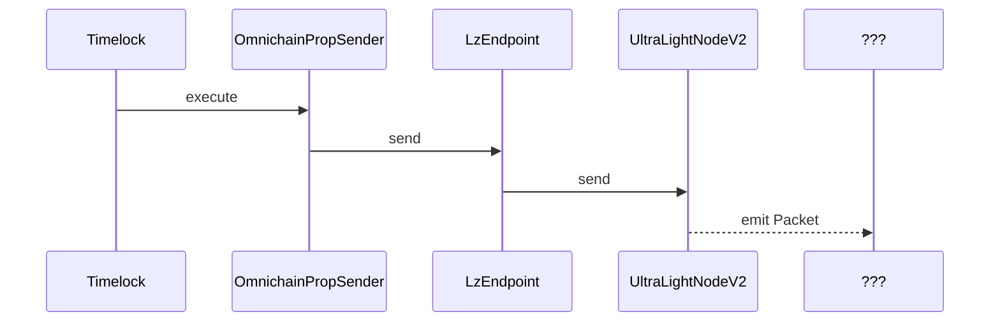
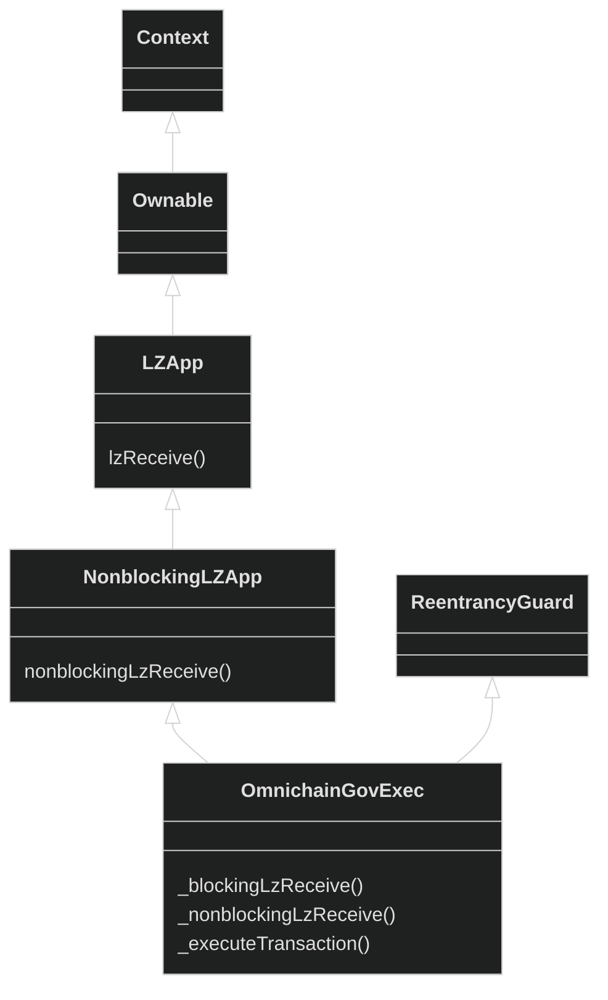
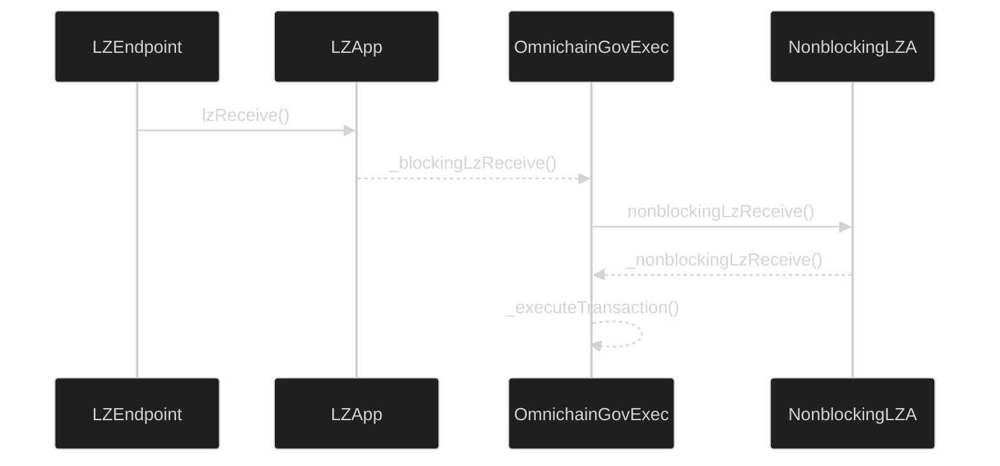

```mermaid
---
config:
    theme: 'dark'
    layout: 'elk'
---
flowchart RL
    subgraph MegaEth
        OGE(OmnichainGovernanceExecutor):::core
        V2(UniswapV2Factory):::core
        V3(UniswapV3Factory):::core
        V4(PoolManager):::core
    end

    V4 -->|owner| OGE
    V3 -->|owner| OGE
    V2 -->|feeToSetter| OGE

    MegaEth:::sub

    classDef core fill:#202020,color:#fff,stroke:#f50db4,stroke-width:4
    classDef sub fill:#121212,colo:#fff,stroke:red
```

```mermaid
---
config:
    theme: 'dark'
    layout: 'elk'
---
flowchart RL
    subgraph Avalanche
        OGE(OmnichainGovernanceExecutor):::core
        V2(UniswapV2Factory):::core
        V3(UniswapV3Factory):::core
        V4(PoolManager):::core
    end

    V4 -->|owner| OGE
    V3 -->|owner| OGE
    V2 -->|feeToSetter| OGE

    Avalanche:::sub

    classDef core fill:#202020,color:#fff,stroke:#f50db4,stroke-width:4
    classDef sub fill:#121212,colo:#fff,stroke:red
```

# Maintenance Proposal

- [Maintenance Proposal](#maintenance-proposal)
  - [Abstract](#abstract)
  - [Actions](#actions)
    - [Finalize Layer Zero Configuration for MegaEth](#finalize-layer-zero-configuration-for-megaeth)
    - [Transfer Ownership on MegaEth from Layer Zero to Wormhole](#transfer-ownership-on-megaeth-from-layer-zero-to-wormhole)
    - [Transfer Ownership on Avalanche from Layer Zero to Wormhole](#transfer-ownership-on-avalanche-from-layer-zero-to-wormhole)
    - [Transfer V2 Fee Setter on Soneium from OptimismPortal2 to CrossChainAccount](#transfer-v2-fee-setter-on-soneium-from-optimismportal2-to-crosschainaccount)
    - [Transfer V4 Ownership on Soneium from OptimismPortal2 to CrossChainAccount](#transfer-v4-ownership-on-soneium-from-optimismportal2-to-crosschainaccount)
    - [Transfer V2 Fee Setter on XLayer from OptimismPortal2 to CrossChainAccount](#transfer-v2-fee-setter-on-xlayer-from-optimismportal2-to-crosschainaccount)
    - [Transfer V4 Ownership on XLayer from OptimismPortal2 to CrossChainAccount](#transfer-v4-ownership-on-xlayer-from-optimismportal2-to-crosschainaccount)
  - [calls](#calls)
  - [configs](#configs)
    - [Ethereum](#ethereum)
    - [Avalanche](#avalanche)
    - [The blockchain known as Make Ethereum Great Again](#the-blockchain-known-as-make-ethereum-great-again)
  - [contract \& flow](#contract--flow)
    - [Sender](#sender)
    - [OmnichainGovernanceExecutor](#omnichaingovernanceexecutor)
  - [lz's example](#lzs-example)

## Abstract

This proposal is a collection of maintenance-related actions for future proposal work. On MegaEth
and Avalanche, we are migrating from Layer Zero V1 to Wormhole ahead of Layer Zero's V1 relayer
service deactivation, which also sets the stage for activating fees using Wormhole fee
infrastructure in the future. On Soneium and XLayer, we are migrating from OP-Stack Portal to
OP-Stack CrossChainAccount on Soneium and XLayer, finalizing the transition to a newer abstraction
that OP-Stack chains use for cross chain message passing, making our governance structure and
presence clearer on those chains and unifying how we send messages to these chains.

## Actions

Governance takes seven actions.

<!-- no toc -->
1. [Finalize Layer Zero Configuration for MegaEth](#finalize-layer-zero-configuration-for-megaeth)
2. [Transfer Ownership on MegaEth from Layer Zero to Wormhole](#transfer-ownership-on-megaeth-from-layer-zero-to-wormhole)
3. [Transfer Ownership on Avalanche from Layer Zero to Wormhole](#transfer-ownership-on-avalanche-from-layer-zero-to-wormhole)
4. [Transfer V2 Fee Setter on Soneium from OptimismPortal2 to CrossChainAccount](#transfer-v2-fee-setter-on-soneium-from-optimismportal2-to-crosschainaccount)
5. [Transfer V4 Ownership on Soneium from OptimismPortal2 to CrossChainAccount](#transfer-v4-ownership-on-soneium-from-optimismportal2-to-crosschainaccount)
6. [Transfer V2 Fee Setter on XLayer from OptimismPortal2 to CrossChainAccount](#transfer-v2-fee-setter-on-xlayer-from-optimismportal2-to-crosschainaccount)
7. [Transfer V4 Ownership on XLayer from OptimismPortal2 to CrossChainAccount](#transfer-v4-ownership-on-xlayer-from-optimismportal2-to-crosschainaccount)

### Finalize Layer Zero Configuration for MegaEth

---

**OVERVIEW:**

This action sets the `trustedRemote` address for the MegaEth chain on our `OmnichainProposalSender`
to the `OmnichainGovernanceExecutor` on MegaEth.

**RELEVANT ADDRESSES:**

| Name                          | Network  | Description                           |
| ----------------------------- | -------- | ------------------------------------- |
| `OmnichainProposalSender`     | Ethereum | Uniswap's Layer Zero message sender   |
| `OmnichainGovernanceExecutor` | MegaEth  | Uniswap's Layer Zero message receiver |

**RESULT:**

```mermaid
---
config:
    theme: 'dark'
    layout: 'elk'
---
flowchart LR
    subgraph Ethereum
        OPS(OmnichainProposalSender):::core
    end

    subgraph MegaEth
        OGE(OmnichainGovernanceExecutor):::core
    end

    OPS -->|trustedRemote| OGE

    Ethereum:::sub
    MegaEth:::sub

    classDef core fill:#202020,color:#fff,stroke:#f50db4,stroke-width:4
    classDef sub fill:#121212,colo:#fff,stroke:#fff
```



### Transfer Ownership on MegaEth from Layer Zero to Wormhole

---

**OVERVIEW:**

This action sets the `feeToSetter` of the V2 Factory and the `owner` of the V3 Factory and Pool
Manager from the layer zero omnichain governance executor to the wormhole receiver on MegaETH.

**RELEVANT ADDRESSES:**

| Name                          | Network  | Description                           |
| ----------------------------- | -------- | ------------------------------------- |
| `OmnichainProposalSender`     | Ethereum | Uniswap's Layer Zero message sender   |
| `OmnichainGovernanceExecutor` | MegaEth  | Uniswap's Layer Zero message receiver |
| `WormholeReceiver`            | MegaEth  | Uniswap's Wormhole message receiver   |
| `UniswapV2Factory`            | MegaEth  | Uniswap's V2 Factory                  |
| `UniswapV3Factory`            | MegaEth  | Uniswap's V3 Factory                  |
| `PoolManager`                 | MegaEth  | Uniswap's V4 Pool Manager             |

**BEFORE:**



**AFTER:**


### Transfer Ownership on Avalanche from Layer Zero to Wormhole

---

**OVERVIEW:**

This action sets the `feeToSetter` of the V2 Factory and the `owner` of the V3 Factory and Pool
Manager from the layer zero omnichain governance executor to the wormhole receiver on Avalanche.

**RELEVANT ADDRESSES:**

| Name                          | Network   | Description                           |
| ----------------------------- | --------- | ------------------------------------- |
| `OmnichainProposalSender`     | Ethereum  | Uniswap's Layer Zero message sender   |
| `OmnichainGovernanceExecutor` | Avalanche | Uniswap's Layer Zero message receiver |
| `WormholeReceiver`            | Avalanche | Uniswap's Wormhole message receiver   |
| `UniswapV2Factory`            | Avalanche | Uniswap's V2 Factory                  |
| `UniswapV3Factory`            | Avalanche | Uniswap's V3 Factory                  |
| `PoolManager`                 | Avalanche | Uniswap's V4 Pool Manager             |

**BEFORE:**



**AFTER:**



```mermaid
---
config:
    theme: 'dark'
    layout: 'elk'
---
flowchart RL
    subgraph Avalanche
        WR(WormholeReceiver):::core
        V2(UniswapV2Factory):::core
        V3(UniswapV3Factory):::core
        V4(PoolManager):::core
    end

    V4 -->|owner| WR
    V3 -->|owner| WR
    V2 -->|feeToSetter| WR

    Avalanche:::sub

    classDef core fill:#202020,color:#fff,stroke:#f50db4,stroke-width:4
    classDef sub fill:#121212,colo:#fff,stroke:green
```

### Transfer V2 Fee Setter on Soneium from OptimismPortal2 to CrossChainAccount

---

**OVERVIEW:**

This action sets the `feeToSetter` of the V2 Factory from the optimism portal to the optimism cross
chain account. 

**RELEVANT ADDRESSES:**

| Name                          | Network   | Description                           |
| ----------------------------- | --------- | ------------------------------------- |
| `OmnichainProposalSender`     | Ethereum  | Uniswap's Layer Zero message sender   |
| `OmnichainGovernanceExecutor` | Avalanche | Uniswap's Layer Zero message receiver |
| `WormholeReceiver`            | Avalanche | Uniswap's Wormhole message receiver   |
| `UniswapV2Factory`            | Avalanche | Uniswap's V2 Factory                  |
| `UniswapV3Factory`            | Avalanche | Uniswap's V3 Factory                  |
| `PoolManager`                 | Avalanche | Uniswap's V4 Pool Manager             |

**BEFORE:**


**AFTER:**


### Transfer V4 Ownership on Soneium from OptimismPortal2 to CrossChainAccount

---

### Transfer V2 Fee Setter on XLayer from OptimismPortal2 to CrossChainAccount

---

### Transfer V4 Ownership on XLayer from OptimismPortal2 to CrossChainAccount

---


avax / mega migration from layer zero to wormhole

## calls

- `OmnichainProposalSender.setTrustedRemoteAddress` (megaEth)
- `OmnichainProposalSender.execute` (megaEth)
  - `IUniswapV2Factory.setFeeToSetter`
  - `IUniswapV3Factory.setOwner`
  - `IPoolManager.transferOwnership`
- `OmnichainProposalSender.execute` (avax)
  - `IUniswapV2Factory.setFeeToSetter`
  - `IUniswapV3Factory.setOwner`
  - `IPoolManager.transferOwnership`

```solidity
function execute(
    uint16 remoteChainId,
    bytes calldata payload,
    bytes calldata adapterParams
) external payable;

function setTrustedRemoteAddress(
    uint16 remoteChainId,
    bytes calldata remoteAddress
) external;
```

## configs

NOTICE:

- eth sender version: 2
- avax recv version: 2
- mega recv version: 1

we'll have to do a hot version swap midflight.

### Ethereum


- timelock `0x1a9C8182C09F50C8318d769245beA52c32BE35BC`
- lz endpoint `0x66A71Dcef29A0fFBDBE3c6a460a3B5BC225Cd675` (lzv1 docs)
- omnichain proposal sender `0xeb0bcf27d1fb4b25e708fbb815c421aeb51ea9fc` (dawg)
- lz send library `0x4D73AdB72bC3DD368966edD0f0b2148401A178E2`

`LzEndpoint.uaConfigLookup(OmnichainProposalSender)`:

```
2
0
0x0000000000000000000000000000000000000000
0x4D73AdB72bC3DD368966edD0f0b2148401A178E2
```

`LzEndpoint.trustedRemoteLookup(lz.avax.id)`:

```
0xeb0bcf27d1fb4b25e708fbb815c421aeb51ea9fceb0bcf27d1fb4b25e708fbb815c421aeb51ea9fc

aka

0xeb0bcf27d1fb4b25e708fbb815c421aeb51ea9fc
0xeb0bcf27d1fb4b25e708fbb815c421aeb51ea9fc
```

`LzEndpoint.trustedRemoteLookup(lz.mega.id)`:

```
0x
```

### Avalanche

- v2 factory `0x9e5A52f57b3038F1B8EeE45F28b3C1967e22799C` (briefcase)
- v3 factory `0x740b1c1de25031C31FF4fC9A62f554A55cdC1baD` (briefcase)
- pool manager `0x06380C0e0912312B5150364B9DC4542BA0DbBc85` (ur constructor)
- omnichain governance executor `0xeb0BCF27D1Fb4b25e708fBB815c421Aeb51eA9fc` (owner/setter)
- lz endpoint `0x3c2269811836af69497E5F486A85D7316753cf62` (omnichain gov exec)
- lz receive library `0x4D73AdB72bC3DD368966edD0f0b2148401A178E2`

`OmnichainGovExec.trustedRemoteLookup(lz.eth.id)` returns:

```
0xeb0bcf27d1fb4b25e708fbb815c421aeb51ea9fceb0bcf27d1fb4b25e708fbb815c421aeb51ea9fc
```
aka
```
0xeb0bcf27d1fb4b25e708fbb815c421aeb51ea9fc
0xeb0bcf27d1fb4b25e708fbb815c421aeb51ea9fc

// or
//
// OmnichainGovExec
// OmnichainGovExec
```

`LzEndpoint.uaConfigLookup(OmnichainGovExec)`:

```
2
2
0x4D73AdB72bC3DD368966edD0f0b2148401A178E2
0x4D73AdB72bC3DD368966edD0f0b2148401A178E2
```

### The blockchain known as Make Ethereum Great Again

- v2 factory `0xbf56488c857a881ae7e3bed27cf99c10a7ab7e50`
- v3 factory `0x3a5f0cd7d62452b7f899b2a5758bfa57be0de478`
- pool man `0xacb7e78fa05d562e0a5d3089ec896d57d057d38e`
- omnichain gov exec `0x8819b86ddF592c3aaAa6f9ec7cE1A0f99FC4322c`
- lz endpoint `0xb6319cC6c8c27A8F5dAF0dD3DF91EA35C4720dd7`

```
0xeb0bcf27d1fb4b25e708fbb815c421aeb51ea9fc8819b86ddf592c3aaaa6f9ec7ce1a0f99fc4322c
```
aka
```
0xeb0bcf27d1fb4b25e708fbb815c421aeb51ea9fc
0x8819b86ddf592c3aaaa6f9ec7ce1a0f99fc4322c
```

## contract & flow

### Sender



packet:

```
abi.encodePacked(
    nonce,
    localChainId,
    ua,
    dstChainId,
    dstAddress,
    payload
);
```

lz's code comment SAYS encoding of the payload is as follows (DOUBLE CHECK):

```
payload = abi.encode(targets, values, signatures, calldatas)
```


### OmnichainGovernanceExecutor

relevant class heirarchy



internal/local call flow:




notes:

- `lzEndpoint` is the caller
- `_payload` is untouched
- `trustedRemoteLookup[_srcChainId] == _srcAddress`
- 

## lz's example

note: no docs on how the payload is processed ????

send

```solidity
// an endpoint is the contract which has the send() function
ILayerZeroEndpoint public endpoint;
// remote address concated with local address packed into 40 bytes
bytes memory remoteAndLocalAddresses = abi.encodePacked(remoteAddress, localAddress);
// call send() to send a message/payload to another chain
endpoint.send{value:msg.value}(
    10001,                   // destination LayerZero chainId
    remoteAndLocalAddresses, // send to this address on the destination
    bytes("hello"),          // bytes payload
    msg.sender,              // refund address
    address(0x0),            // future parameter
    bytes("")                // adapterParams (see "Advanced Features")
);
```

receive

```solidity
pragma solidity 0.8.4;
pragma abicoder v2;

import "../lzApp/NonblockingLzApp.sol";

/// @title A LayerZero example sending a cross chain message from a source chain to a destination chain to increment a counter
contract OmniCounter is NonblockingLzApp {
    uint public counter;

    constructor(address _lzEndpoint) NonblockingLzApp(_lzEndpoint) {}

    function _nonblockingLzReceive(uint16, bytes memory, uint64, bytes memory) internal override {
        // _nonblockingLzReceive is how we provide custom logic to lzReceive()
        // in this case, increment a counter when a message is received.
        counter += 1;
    }

    function incrementCounter(uint16 _dstChainId) public payable {
        // _lzSend calls endpoint.send()
        _lzSend(_dstChainId, bytes(""), payable(msg.sender), address(0x0), bytes(""));
    }
}
```

```
Call memory configureLayerZeroEthereum = Call({
  target: Constants.Ethereum.OMNICHAIN_PROPOSAL_SENDER,
  value: 0,
  data: abi.encodeCall(
    IOmnichainProposalSender.setTrustedRemoteAddress,
    (
      Constants.LayerZero.MEGA_CHAIN_ID,
      abi.encodePacked(Constants.MegaEth.OMNICHAIN_GOVERNANCE_EXECUTOR)
    )
  )
});

Call memory transferOwnershipMega = LayerZeroEncoder.encode({
  omnichainProposalSender: Constants.Ethereum.OMNICHAIN_PROPOSAL_SENDER,
  layerZeroChainId: Constants.LayerZero.MEGA_CHAIN_ID,
  remoteCalls: LibCall.newCalls(
    [
      Call({
        target: uniswap.megaEth.v2Factory,
        value: 0,
        data: abi.encodeCall(
          IUniswapV2Factory.setFeeToSetter, (Constants.MegaEth.WORMHOLE_RECEIVER)
        )
      }),
      Call({
        target: uniswap.megaEth.v3Factory,
        value: 0,
        data: abi.encodeCall(IUniswapV3Factory.setOwner, (Constants.MegaEth.WORMHOLE_RECEIVER))
      }),
      Call({
        target: uniswap.megaEth.poolManager,
        value: 0,
        data: abi.encodeCall(
          IPoolManager.transferOwnership, (Constants.MegaEth.WORMHOLE_RECEIVER)
        )
      })
    ]
  )
});

Call memory transferOwnershipAvalanche = LayerZeroEncoder.encode({
  omnichainProposalSender: Constants.Ethereum.OMNICHAIN_PROPOSAL_SENDER,
  layerZeroChainId: Constants.LayerZero.AVAX_CHAIN_ID,
  remoteCalls: LibCall.newCalls(
    [
      Call({
        target: uniswap.avalanche.v2Factory,
        value: 0,
        data: abi.encodeCall(
          IUniswapV2Factory.setFeeToSetter, (Constants.Avalanche.WORMHOLE_RECEIVER)
        )
      }),
      Call({
        target: uniswap.avalanche.v3Factory,
        value: 0,
        data: abi.encodeCall(
          IUniswapV3Factory.setOwner, (Constants.Avalanche.WORMHOLE_RECEIVER)
        )
      }),
      Call({
        target: uniswap.avalanche.poolManager,
        value: 0,
        data: abi.encodeCall(
          IPoolManager.transferOwnership, (Constants.Avalanche.WORMHOLE_RECEIVER)
        )
      })
    ]
  )
});
```
