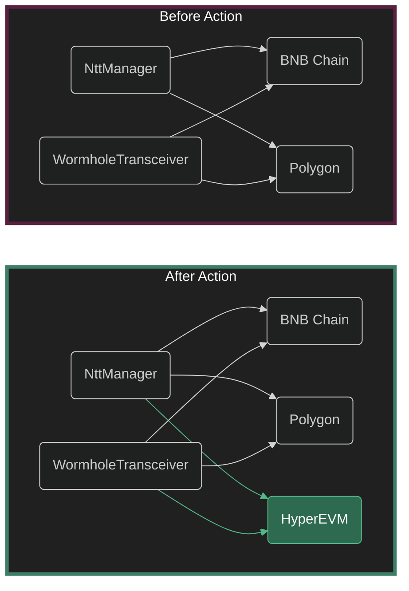
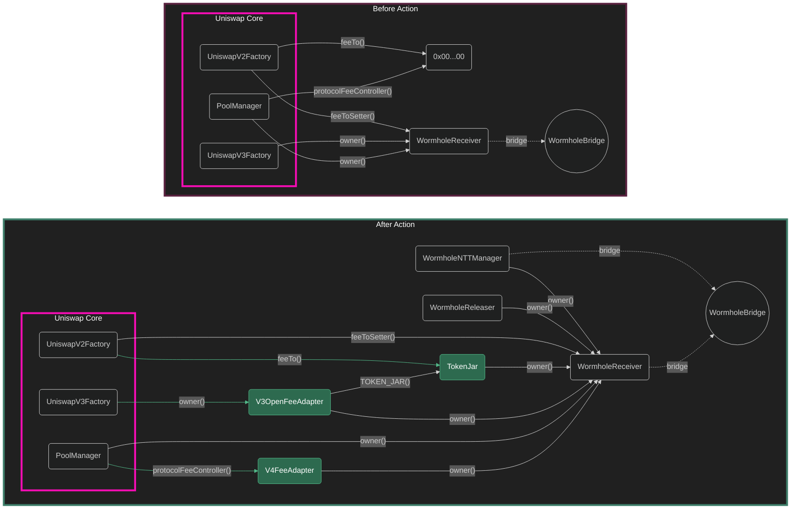

# Proposal 7

Activates v2, v3, and v4 protocol fees on HyperEVM, and registers HyperEVM as a Wormhole NTT peer on Ethereum so that UNI burned there releases on mainnet.

HyperEVM has no canonical bridge to Ethereum, so the burn path uses Wormhole's Native Token Transfer system, the same mechanism proposal 4 activated for BNB Chain and Polygon. Fee infrastructure is deployed permissionlessly ahead of the vote and handed to the governance-owned Wormhole receiver, so the proposal itself only does the two things governance alone can do: register the peer on Ethereum, and flip the three fee switches on HyperEVM over Wormhole.

## Wormhole context

Unchanged from proposal 4. See its [Wormhole Context](../proposal-4/Index.md#wormhole-context) for the send and receive paths, the burn-over-Wormhole flow, and the note on why the NTT contracts use ERC-1967 proxies.

## HyperEVM context

HyperEVM produces two kinds of blocks. Small blocks land every second with a 3M gas limit; big blocks land once a minute with a 30M limit. Which kind a transaction lands in is a flag on the sender's HyperCore account, not a property of the transaction.

Deploying the `NttManager` implementation alone costs about 4.5M gas, which no small block can hold. Before running the prerequisite script the deployer must opt in:

```json
{"type": "evmUserModify", "usingBigBlocks": true}
```

Every transaction from that account then waits on the one-minute cadence until the flag is unset, which should happen only after the prerequisite script has run.

The script also needs a HYPE balance for gas **and** for Wormhole core message fees. The fee is zero on HyperEVM today, matching BNB Chain, but should be queried at run time.

| Name                | Network  | Value                                        | Description                                     |
| ------------------- | -------- | -------------------------------------------- | ----------------------------------------------- |
| `CHAIN_ID`          | HyperEVM | `999`                                        | EIP-155 chain id                                |
| `WORMHOLE_CHAIN_ID` | HyperEVM | `47`                                         | Wormhole-defined chain id                       |
| `WORMHOLE_CORE`     | HyperEVM | `0x7C0faFc4384551f063e05aee704ab943b8B53aB3` | Wormhole core bridge, deployed by Wormhole      |
| `WORMHOLE_SENDER`   | Ethereum | `0xf5F4496219F31CDCBa6130B5402873624585615a` | Uniswap's Wormhole sender, owned by the Timelock |

New-chain addresses live in [`params/Constants.sol`](./params/Constants.sol) until the proposal activating them has executed, then move to govkit's address book. That file is the single source for every value below; the tables in this document restate it, so change it first.

## Prerequisite actions

These are permissionless and must all be done before governance can act. Step 1 writes one record file, `.records/HyperEVM.json`, which step 2 reads. Step 1 refuses to run twice; clear the record deliberately to redeploy.

1. [Deploy fee infra](#1-deploy-fee-infra)
2. [Write the proposal](#2-write-the-proposal)

### 1. Deploy fee infra

**Overview**:

On HyperEVM we deploy `SyntheticNttUni`, `NttManagerNoRateLimiting`, `WormholeTransceiver`, and `ERC1967Proxy` contracts for the latter. We initialize the proxies, register the transceiver with the manager, set `SyntheticNttUni`'s minting authority to the manager, and register Ethereum as a peer on both. We then transfer everything to the governance receiver and renounce the pauser capability on both proxies.

We then deploy `TokenJar`, `WormholeReleaser`, `V3OpenFeeAdapter`, `V4FeeAdapter`, and `V4FeePolicy`. Each contract keeps deployer authority only for as long as its own configuration needs, then hands both ownership and the fee-setter role to the governance receiver.

The script holds HyperEVM's parameters and nothing else. The work is in [`DeployFeeInfra`](./prereq/DeployFeeInfra.sol), the fee phase (transactions `F.00` to `F.31`: TokenJar, releaser, v3 and v4 adapters), and [`DeployFeeInfraWormhole`](./prereq/DeployFeeInfraWormhole.sol), which puts the Wormhole phase in front of it (`W.00` to `W.15`: synthetic UNI and the NTT stack) and supplies the releaser through `_deployReleaser`. Transaction labels stay with their phase, so `F.07` is the same transaction on any chain.

Proposal 4 split this into three scripts per chain, because the infra for Ethereum was brought up in the same proposal and so the peers were not known until every chain had deployed. Nothing is deployed on the Ethereum side this time, so the peers are known up front and everything collapses into one run.

The v3 tier defaults match every chain where fees are live. The v4 fee buckets, aggregator flag rule, and aggregator family default match every chain configured by proposal 6. Both come from [`script/shared/FeeSchedule.sol`](../shared/FeeSchedule.sol). Proposal 6's two per-chain lists, hook family assignments and stable-stable pairs, are CSV files in [`params/hyperevm/`](./params/hyperevm/), read at run time through [`script/shared/Lists.sol`](../shared/Lists.sol). Both are header-only for HyperEVM, and the transaction that applies each is skipped while its list is empty.

**Foundry Script**:

[`./prereq/DeployFeeInfraHyperEVM.s.sol`](./prereq/DeployFeeInfraHyperEVM.s.sol)

**Shell Command**:

```bash
# from root directory of this repository:
forge script script/proposal-7/prereq/DeployFeeInfraHyperEVM.s.sol --rpc-url hyperevm --broadcast
```

**Transactions**, Wormhole phase:

| Index | Action                                                                              |
| ----- | ----------------------------------------------------------------------------------- |
| W.00  | (Implicit) Deploy the `TransceiverStructs` external library for wormhole contracts. |
| W.01  | Deploy `SyntheticNttUni`.                                                           |
| W.02  | Deploy `NttManager` implementation.                                                 |
| W.03  | Deploy `NttManager` proxy.                                                          |
| W.04  | Initialize `NttManager` proxy.                                                      |
| W.05  | Deploy `WormholeTransceiver` implementation.                                        |
| W.06  | Deploy `WormholeTransceiver` proxy.                                                 |
| W.07  | Initialize `WormholeTransceiver` proxy.                                             |
| W.08  | Set `NttManager` proxy's transceiver to the `WormholeTransceiver` proxy.            |
| W.09  | Set `SyntheticNttUni` mint authority to `NttManager` proxy.                         |
| W.10  | Set the Ethereum `WormholeTransceiver` as a peer.                                   |
| W.11  | Set the Ethereum `NttManager` as a peer.                                            |
| W.12  | Transfer ownership of `SyntheticNttUni` to governance.                              |
| W.13  | Transfer ownership of `NttManager`, and with it the transceiver, to governance.     |
| W.14  | Renounce pauser capability on the `WormholeTransceiver` proxy.                      |
| W.15  | Renounce pauser capability on the `NttManager` proxy.                               |

**Transactions**, fee phase:

| Index                  | Action                                                                          |
| ---------------------- | ------------------------------------------------------------------------------- |
| F.00                   | Deploy `TokenJar`.                                                              |
| F.01                   | Deploy the releaser, `WormholeReleaser` here, through `_deployReleaser`.        |
| F.02                   | Set the releaser on `TokenJar`.                                                 |
| F.03                   | Transfer `TokenJar` ownership to governance.                                    |
| F.04                   | Set the releaser's threshold-setter to governance.                              |
| F.05                   | Transfer ownership of the releaser to governance.                               |
| F.06                   | Deploy `V3OpenFeeAdapter`.                                                      |
| F.07                   | Set `V3OpenFeeAdapter` fee-setter to the deployer for configuration.            |
| F.08                   | Set `V3OpenFeeAdapter` default fee.                                             |
| F.09, F.10, F.11, F.12 | Set `V3OpenFeeAdapter` fee tier defaults.                                       |
| F.13, F.14, F.15, F.16 | Store `V3OpenFeeAdapter` fee tiers.                                             |
| F.17                   | Transfer `V3OpenFeeAdapter` fee-setter permission to governance.                |
| F.18                   | Transfer `V3OpenFeeAdapter` ownership to governance.                            |
| F.19                   | Deploy `V4FeeAdapter`.                                                          |
| F.20                   | Deploy `V4FeePolicy`.                                                           |
| F.21                   | Set `V4FeePolicy` on `V4FeeAdapter`.                                            |
| F.22                   | Set `V4FeePolicy` fee-setter to the deployer for configuration.                 |
| F.23                   | Set `V4FeePolicy` fee buckets.                                                  |
| F.24                   | Set `V4FeePolicy` flag rules.                                                   |
| F.25                   | Set `V4FeePolicy` aggregator hook family default.                               |
| F.26                   | Assign `V4FeePolicy` hook families by address. Skipped while the list is empty. |
| F.27                   | Set `V4FeePolicy` stable-stable pair fees. Skipped while the list is empty.     |
| F.28                   | Transfer `V4FeePolicy` fee-setter permission to governance.                     |
| F.29                   | Transfer `V4FeePolicy` ownership to governance.                                 |
| F.30                   | Transfer `V4FeeAdapter` fee-setter permission to governance.                    |
| F.31                   | Transfer `V4FeeAdapter` ownership to governance.                                |

> Note: proposal 4 and Wormhole's own script call `setThreshold(1)` after registering the transceiver. It is a no-op, because registering the first transceiver already raises the threshold from 0 to 1 and the manager rejects any value above the number of enabled transceivers. Here, we omit the transaction and assert the property instead.

**Verification**:

Re-runs every assertion against the chain rather than against the simulation, reading the deployment out of the record. The assertions live in [`script/shared/FeeInfraChecks.sol`](../shared/FeeInfraChecks.sol) and [`WormholeInfraChecks.sol`](../shared/WormholeInfraChecks.sol), and compare the deployment against the params the script gave it:

```bash
forge script script/proposal-7/prereq/DeployFeeInfraHyperEVM.s.sol --sig "check()" --rpc-url hyperevm
```

### 2. Write the proposal

**Overview**:

Reads the prerequisite deployments out of the record and writes the proposal to `./out/.seatbelt/HyperEVMFeeProposal.json` for Seatbelt. It does not broadcast; the `propose` call is made separately from that output. Run against Ethereum, where it also asserts that every target answers to the Timelock and that neither NTT contract knows HyperEVM yet.

**Foundry Script**:

[`./HyperEVMFees.s.sol`](./HyperEVMFees.s.sol)

**Shell Command**:

```bash
# from root directory of this repository:
forge script script/proposal-7/HyperEVMFees.s.sol --rpc-url mainnet
```

**Preflight**:

The HyperEVM half assumes the receiver trusts the Ethereum sender and already holds the v2 `feeToSetter`, the v3 `owner`, and the `PoolManager` `owner`. That handoff is a prerequisite for this proposal. Run `preflight()` against HyperEVM before proposing, since a failure otherwise surfaces only when the message is relayed after the vote:

```bash
forge script script/proposal-7/HyperEVMFees.s.sol --sig "preflight()" --rpc-url hyperevm
```

## Governance actions

### Ethereum actions

---

**OVERVIEW**:

Registers the HyperEVM `WormholeTransceiver` and `NttManager` as peers on their Ethereum counterparts, which proposal 4 deployed and the Timelock owns. This is what lets UNI burned on HyperEVM release on Ethereum. Without it the burn path does not complete.

**RELEVANT ADDRESSES**:

| Name                  | Network  | Address                                      | Description                             |
| --------------------- | -------- | -------------------------------------------- | --------------------------------------- |
| `nttManager`          | Ethereum | `0x6569925Aac77D6B8Bb085F31F9828ff80D5a0c44` | Ethereum NTT manager, from proposal 4   |
| `wormholeTransceiver` | Ethereum | `0x7597C40Fd3df66b750C14ad4D90524e247499011` | Ethereum transceiver, from proposal 4   |
| `timelock`            | Ethereum | `0x1a9C8182C09F50C8318d769245beA52c32BE35BC` | Owner of both, and the proposal executor |
| `NttManager`          | HyperEVM | recorded by step 1                           | Peer being registered                   |
| `WormholeTransceiver` | HyperEVM | recorded by step 1                           | Peer being registered                   |

**ACTIONS**:

- From the `Timelock`:
    - Set the HyperEVM `WormholeTransceiver` as a peer on the Ethereum `WormholeTransceiver`.
    - Set the HyperEVM `NttManager` as a peer on the Ethereum `NttManager`.

**BEFORE AND AFTER**:



This proposal's changes (including prerequisite deployments) are in green. Both peer registrations happen on Ethereum, on contracts proposal 4 deployed.

### HyperEVM actions

---

**OVERVIEW**:

One Wormhole message carrying three calls, executed by the `UniswapWormholeMessageReceiver`, which owns all three protocol contracts. V3 sends fees to the factory owner, so activating v3 means transferring factory ownership to the `V3OpenFeeAdapter` rather than setting a collector.

**RELEVANT ADDRESSES**:

| Name                | Network  | Address                                              | Description                        |
| ------------------- | -------- | ---------------------------------------------------- | ---------------------------------- |
| `V2_FACTORY`        | HyperEVM | see [`params/Constants.sol`](./params/Constants.sol) | Uniswap V2 Factory                 |
| `V3_FACTORY`        | HyperEVM | see [`params/Constants.sol`](./params/Constants.sol) | Uniswap V3 Factory                 |
| `POOL_MANAGER`      | HyperEVM | see [`params/Constants.sol`](./params/Constants.sol) | Uniswap V4 Pool Manager            |
| `WORMHOLE_RECEIVER` | HyperEVM | see [`params/Constants.sol`](./params/Constants.sol) | Governance owned Wormhole receiver |
| `WORMHOLE_SENDER`   | Ethereum | `0xf5F4496219F31CDCBa6130B5402873624585615a`         | Wormhole sender, owned by Timelock |
| `TokenJar`          | HyperEVM | recorded by step 1                                   | Fee destination                    |
| `V3OpenFeeAdapter`  | HyperEVM | recorded by step 1                                   | New V3 factory owner               |
| `V4FeeAdapter`      | HyperEVM | recorded by step 1                                   | New protocol fee controller        |

**ACTIONS**:

- From `UniswapWormholeMessageReceiver`:
    - Set `UniswapV2Factory.feeTo` to `TokenJar`.
    - Set `UniswapV3Factory.owner` to `V3OpenFeeAdapter`.
    - Set `PoolManager.protocolFeeController` to `V4FeeAdapter`.

**BEFORE AND AFTER**:



This proposal's changes (including prerequisite deployments) are in green.

## Relaying the message

Wormhole does not deliver the HyperEVM message. After the proposal executes, the VAA for the HyperEVM action has to be fetched from Wormhole's API and passed to `receiveMessage` on the receiver. Proposal 4 did this with a finalizer script carrying the VAA bytes; the equivalent here can only be written once there is a VAA.

Someone, potentially Wormhole, will sometimes batch-relay messages themselves. Nothing in that path logs an observable event or shows as a transaction on Etherscan-style explorers, so a later relay attempt reverts as a replay and looks like a failure even though the message already executed.
